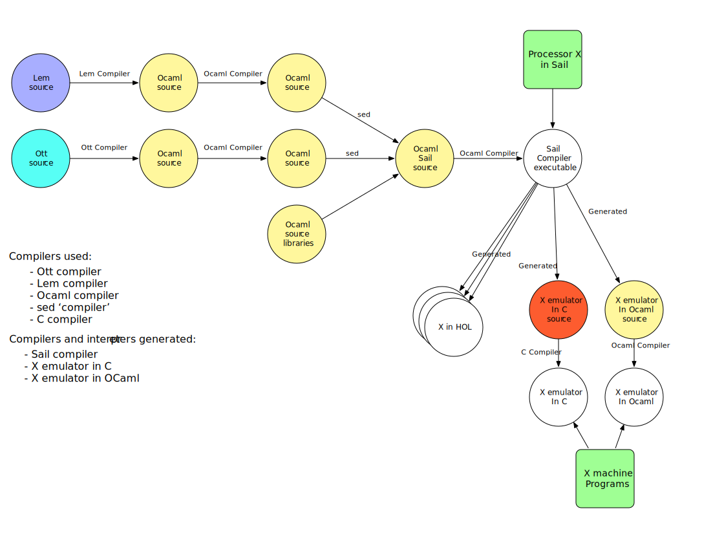
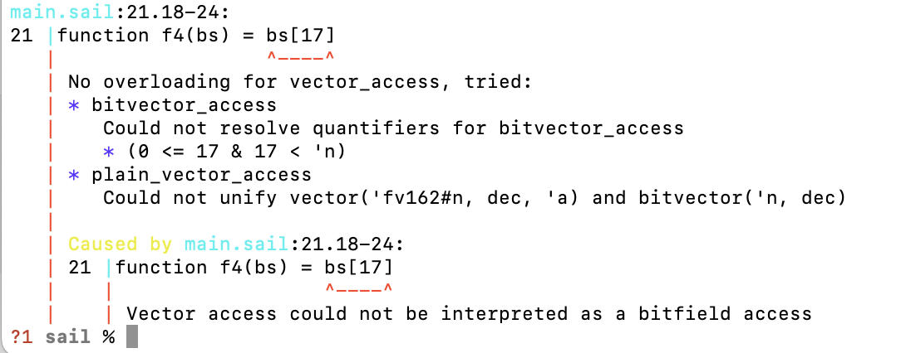
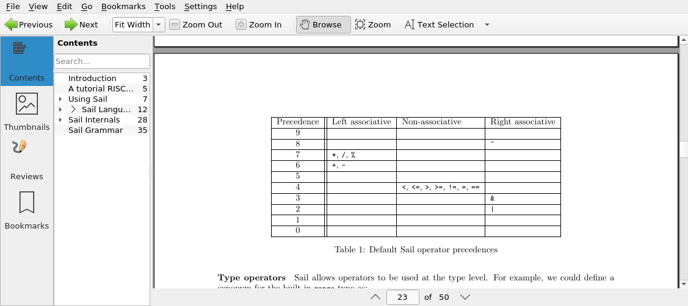

// =========================================================================
// DO NOT EDIT.  AUTOGENERATED FILE.  You probably want to edit TheSailCookbook_Main.adoc
// =========================================================================
:doctype: book
:sectids:
The Sail Programming Language: A Sail Cookbook
==============================================
William C. McSpadden <bill@riscv.org>; Martin Berger <contact@martinfriedrichberger.net>
:toc:
:toc-placement: preamble
:toclevels: 2

:showtitle:


// Need some preamble to get TOC
{empty}


[#list_of_programming_examples]
== List of programming examples (in increasing complexity)

The main purpose of this document,  is to give the user a quick
reference to Sail coding examples. The following is a list of
all the programming examples found in this document.

<<hello_world>>

<<print__FILE__LOC__>>

<<my_replicate_bits>>

<<list_iteration_example>>

<<scattered-definitions>>

<<Sail-Calls-C-function>>

<<Sail-Calls-C-function-for-YAML>>

<<simple_cpu_example>>


:sectnums:
== Introduction

Sail is a programming language that was developed for the purpose
of clearly, concisely and completely describing a computer's
Instruction Set Architecture (ISA).  This includes...

- specifying the opcodes/instructions and their behaviours
- specifying the general purpose registers
- specifying the control space registers

Sail was the language chosen by RISC-V International
to formally specify the RISC-V open source ISA.

This document,  while not RISC-V specific,  is especially targeted for engineers who are working on specifying the RISC-V ISA.

This cookbook is intended to supply the beginning Sail programmer with
some simple, well-commented, bite-size program fragments that can
be compiled and run.

**github** is used to host the development of Sail.  You can find the
repository at the following URL:

https://github.com/rems-project/sail

Currently,  the work on this cookbook can be found on a branch in the
above repo.  This branch is:

https://github.com/billmcspadden-riscv/sail/tree/cookbook_br

So this is the place you should probably clone.  (Eventually,  this
branch will be merged to the release branch.)

Other documentation:

There is another useful Sail document that you should know about.  It is
"The Sail instruction-set semantics specification language" by Armstrong, et. al.  It can be found at:

https://github.com/billmcspadden-riscv/sail/blob/cookbook_br/manual.pdf

While useful,  the document does not contain a useful set of programming
examples.  That is the purpose of *this* document.


== How to contribute (Bill)

We are hopeful that as you learn the Sail programming language,  that you too would want to create some code snippets that you think someone might find helpful.

The simple "hello world" program (found in cookbook/functional_code_snippets/hello_world/) provides a template for writing a new code snippet. For an example
that lives in a single Sail file, this should be sufficient.  Create a test directory (with a useful name), copy the Makefile and the .sail file into that directory,  and then write your code.  And finally,
edit this .adoc file and give a description of what
the example file is intended to do.

Once you have completed your snippet and verifies that it works,  you should make an entry in this document.  Pleas see <<hello_world>> to see how you should include your snippet in this document.  You should at least include the .sail file and give a brief descritpion.  Also, please make an entry in
<<list_of_programming_examples>> for quick perusal by readers.


=== Coding and indentation style

We do not have a preferred coding style for these little code snippets.  With regards to indentation style,  the RISC-V modle follows a vaguely K&R style. Some of the program snippets (those originating with Bill McSpadden) follow the Whitesmiths indentation style.  All styles are welcome.

For a list and description of popular indentation styles, steer your browser to...
https://en.wikipedia.org/wiki/Indentation_style.

=== Brevity

Program examples should be short, both in terms of number-of-lines and in terms of execution time.  Each example should focus on one simple item.  And the execution of the example item should be clear.  The example should be short, standalone and easy to maintain.

Now,  we do have one example in this Cookbook that somewhat violates this request.  The programming example, <<simple_cpu_exampl>>,  is more complex.  But it is meant to demonstrate the usefulness of Sail in defining the functionality of an ISA.

=== Maintainership (when something breaks)

We would also ask that if you contribute a code example,  that you would maintain it.

=== Syntax highlighting for Sail

Syntax highlighting for several editors (emacs, vim, Visual Studio, etc)
can be found at:

https://github.com/rems-project/sail/tree/sail2/editors

It is beyond the scope of this document to describe how to use
the syntax highlighting for the various editors.

== Sail installation

Sail is supported on a number of different platforms.  MacOs and Lunix/Ubuntu seem to be the most used platforms.


TBD

=== Ubuntu (Bill Mc.)

TBD

=== MacOS


Installation with `brew` and `opam` is straighforward. On my
MacBook Pro, with an M1 Processor, runniung Ventura 13.0.1, I followed
the instructions at https://github.com/rems-project/sail/blob/sail2/INSTALL.md[]


I use brew (https://brew.sh/) to install software. With brew I install opam https://opam.ocaml.org/ and Ocaml itself (https://ocaml.org/). Then I follow these steps:

----
    ocaml -version
    eval $(opam config env)
    xcode-select --install
    brew install gmp z3 pkg-config
    opam install sail
----

Depending what is already installed on your computer, some of the above my not be necessary. When running `opam install sail` you will be asked `Do you want to continue?` and you need to answer `y`. You can run `sail -v` to see what version you have installed.

=== Docker

Docker is used as a ....

=== Windows
Support of a native command line interface is not planned.  If you
want to run Sail under Windows,  plan on running it under Cygwin or
Windows Subsystem under Linux.

=== Windows: Cygwin and/or WSL (Bill Mc.,  low priority)

If there is a demand,  a port to Cygwin will be attempted.

=== Other?

Are there other OS platforms that should be supported?
Other Linux distis?  Or will Docker support?

== Basic description
=== What Sail is
Sail is a domain-specific programming language that is
intended for specifying an ISA in as convenient and rigorous a manner as possible. Sail's main focus is verification. Once specified, a Sail program can be compiled to multiple backends:

- A C-model. This is an ISA simulator. It takes as input
 a set of instructions (usually found in a .elf file), and runs them. The results observed.

- Various prover backends, including
  - Isabelle/HOL
  - HOL
  - Coq
  - SMT-LIB
  Since a processor is essentially a state transformer, the specification is translated to a logical formula that expresses  the state transition relation logically.

The model is a sequential model only;  at this time,
there are no semantics allowing for any type of parallel
execution.

=== What Sail is not

Sail is not an RTL (Register Transfer Language).
There is no direct support for timing (as in clock
timing) and there is no support for parallel execution,
all things that an RTL contains.

A mental model for Sail is that it lets you express what an **external** oberver, i.e. software can see of a processor. Sail is not about micro-architecture.


== Sail compilation

=== Cambridge compiler

Sail has currently one main compiler, https://github.com/rems-project/sail[see here]. It currently compiles to the following backends.

1. Simulators (which run programs of the modelled ISA):
  - C simulator (this is the main one)
  - Ocaml simulator (exists mostly for historical purposes)

2. Logical theories (which render the description of the ISA in logical form) using the following logical systems:
    - Isabelle/HOL (see e.g. https://github.com/riscv/sail-riscv/tree/master/prover_snapshots/isabelle[here] for RISC-V models in HOL.)
    - HOL4
    - Coq
    - SMT-LIB

Building the Sail system itself is a multi-stage meta-programming process, that the picture below captures in some detail.



=== Pydrofoil backend.

Sail was developed with a  emphasis on correctness and verification. One consequence is that the compiler from Sail to C is quite conservative in its optimisations, since correctness of compiler optimisatins is highly nonp-trivial. Hence generated C-simulators can be relatively slow.

https://github.com/pydrofoil/pydrofoil[Pydrofoil] is a new tracing-JIT compiler for Sail, based on the https://www.pypy.org/[PyPy] meta-tracing framework. This is currently under active development. As of December 2022, support for infinite precision floating point arithmetic is  the main missing feature.


[#hello_world]
== “Hello, World” example program (Bill)
All example programs associated with this cookbook,
can be found in
<sail_git_root>/cookbook/functional_code_snippets/

The purpose of this simple program is to show some
of the basics of Sail and to ensure that you have
the Sail compiler (and the other required tools)
 installed in your environment.

It is assumed that you have built the sail compiler
in the local area. The Makefiles in the coding
examples depend on this.

The following code snippet comes from:

https://github.com/billmcspadden-riscv/sail/tree/cookbook_br/cookbook/functional_code_snippets/hello_world

hello_world.sail:

// include doesn't appear to render in github
// Therefore, asciidoctor-reducer will be used to create
// a complete (all files included) file, which will be
// committed by git.

[source, sail]
----

// ==========================================================================

// Two types of comments...
// This type and ...

/*
...block comments
*/

// Whitespace is NOT significant. Yay!

default Order dec   // Required. Defines whether bit vectors are increasing 
                    // (inc) (MSB is index 0 or decreasing (dec) (LSB is index 0)

// The $include directive is used to pull in other Sail code.
//  It functions similarly, but not exactly the same, as the
//  C preproessor directrive.

// Sail is a very small language.  In order to get a set
//  of useful functionality (eg - print to stdout), a set
//  of functions and datatypes are defined in the file
//  "prelude.sail"
$include <prelude.sail>

// ========================================================
// Function signatures (same idea as C's function prototype)
// ========================================================

val "print" : string -> unit

val main : unit -> unit

// ========================================================
// The entry point into the program starts at the function, main.
// ========================================================
function main() = 
    {
    print("hello, world!\n") ;
    print("hello, another world!\n") ;
    }

----

So... that's the code we want to compile.  But how do
we compile it? Remember, we want to use the sail
compiler that was built in this sandbox.  We use a
'make' methodology for building.  The first Makefile
(in the same directory as the example code example)
is very simple.  It includes a generic Makefile
(../Makefile.generic) that is used for building
most of the program examples.


[Note]  If you want to create and contribute your
own example program and you need to deviate from
our make methodolgy,  you would do that in your
own test directory by writing your own Makefile.

The basic flow for building is:

. Write *.sail
. sail -c *.sail -o out.c
. gcc <flags> *.c --> executable


Makefile:

[source, makefile]
----
# vim: set tabstop=4 shiftwidth=4 noexpandtab
# ================================================================
# Filename:		Makefile
#
# Description:	Makefile for building example code
#
# Author(s):	Bill McSpadden (bill@riscv.org)
#
# Revision:		See revision control log 
#
# ================================================================

#==============
# Includes
#==============

include ../Makefile.generic

----

Makefile.generic is the Makefile that does the work for compilation.
It depends on a local compilation of sail. See the [Installation](#sail-installation)
section to understand how to install in the tools for your platform.

Makefile.generic:

[source, makefile]
----
# vim: set tabstop=4 shiftwidth=4 noexpandtab
# ==========================================================================
# Filename:		Makefile
#
# Description:	Makefile for building Sail example code fragments
#
#				NOTE: in order to render this file in an asciidoc
#				for the Sail cookbook, keep the line length less 
#				then 86 characters, the width of the block comment line
#				of this section
#
# Author(s):	Bill McSpadden (bill@riscv.org)
#
# Revision:		See revision control log 
#
# ==========================================================================

#==============
# Includes
#==============

#==============
# Make variables
#==============

# The sail compiler expects that SAIL_DIR is set in the environment.
#	The sh env var, SAIL_DIR,  is set and exported using the make
#	variable, SAIL_DIR.  I hope this is not too confusing.
SAIL_DIR		:= ../../..
SAIL_LIB		:= ${SAIL_DIR}/lib/sail
SAIL			:= ${SAIL_DIR}/sail
SAIL_OUTFILE	:= out
SAIL_FLAGS		:= -c -o ${SAIL_OUTFILE}

SAIL_SRC		?= $(wildcard *.sail)

CC				:= gcc
CCFLAGS			:= -lgmp -lz -I ${SAIL_DIR}/lib/

# out.c is the file that sail generates as output from the
#   sail compilation process.  It will be compiled with
#   other C code to generate an executable
# ${SAIL_DIR}/lib/*.c is a set of C code used for interaction
#   with the programming environment.  It also provides 
#   functionality that cannot be natively supported by sail.
#   
C_SRC			:= out.c ${SAIL_DIR}/lib/*.c 

TARGET			:= out

#==============
# Targets and Rules
#==============

all: run

build: out

install:

run: out
	./out

out: out.c
	gcc ${C_SRC} ${CCFLAGS} -o $@

#	gcc out.c ${SAIL_DIR}/lib/*.c -lgmp -lz -I ${SAIL_DIR}/lib -o $@

# In the following rule,  the environment variable, SAIL_DIR,  must be
#	set  in order for the sail compilation step to work correctly.
out.c: ${SAIL_SRC}
	SAIL_DIR=${SAIL_DIR} ; export SAIL_DIR ; \
	${SAIL} ${SAIL_FLAGS} ${SAIL_SRC}

# clean:  cleans only local artifacts
clean:
	rm -f out out.c out.ml

# Cleans local artifacts and the install location
clean_all:


----

What does the compilation process look like?  Under Ubuntu Linux,  this
is the output you can expect for compiling and running the "hello world"
example program.

```
ubuntu-VirtualBox 227> make
SAIL_DIR=../../.. ; export SAIL_DIR ; \
../../../sail -c -o out hello_world.sail
gcc out.c ../../../lib/*.c  -lgmp -lz -I ../../../lib/ -o out
./out
hello, world!
hello, another world!
ubuntu-VirtualBox 228>

```

Now that we've examined the Makefiles,  we will make little mention of them
in the rest of this document (except for the example where we discuss the
C foreign function interface where we will show how Sail can call C functions).

=== "Hello, World" and the Sail interactive interpretter

This section is meant to introduce you to the the Sail interactive interpretter.
We will not go into much detail about running it;  we'll simply take you through the
hello_world example to show you how it is run.

'1. Invocation....

image:images/sail_i_hello_world_1.png[]

'2. Execute the main() function....

image:images/sail_i_hello_world_2.png[]

'3. Each "step" in the following images is caused by hitting the "enter" key.
This steps you from one statement to another.  Note the top line: we are being
told we are in the main() function.

image:images/sail_i_hello_world_3.png[]

'4. "enter"

image:images/sail_i_hello_world_4.png[]

'5. "enter".   We now see the body of the main() function.

image:images/sail_i_hello_world_5.png[]

'6. "enter"

image:images/sail_i_hello_world_6.png[]

'7. "enter"

image:images/sail_i_hello_world_7.png[]

'8. "enter". On the top line,  we see the output from the print()
statement, "hello, world".

image:images/sail_i_hello_world_8.png[]

'9. "enter"

image:images/sail_i_hello_world_9.png[]

'10. "enter"

image:images/sail_i_hello_world_10.png[]

'11. "enter".  And now we see the output from the second print statement
pn the top line.

image:images/sail_i_hello_world_11.png[]

'12. "enter"

image:images/sail_i_hello_world_12.png[]

'13. "enter"

image:images/sail_i_hello_world_13.png[]

'14. "enter".  We have completed executing the function. The
Result is printed out.

image:images/sail_i_hello_world_14.png[]

'15. ... and now  ... quit and exit....

image:images/sail_i_hello_world_15.png[]

=== How to print file name and location in print statements: `__FILE__, __LOC__`
[#print__FILE__LOC__]
A relatively recent addition  to sail was the addition of the keywords
`__FILE__` amnd `__LOC__`.  These function in much the same way as in C.
`__FILE__` expands to the filename. `__LOC__` (similar to `__LINE__` in C)
expands to the line number and character position where the keyword was
found.   These are useful for debug and error statments.

`printf__FILE__LOC__.sail`:

[source, sail]
----
// Demonstrates the use of __FILE__,  __LOC__

$include <prelude.sail>

// ========================================================
// Function signatures (same idea as C's function prototype)
// ========================================================

val "print" : string -> unit

val main : unit -> unit

// ========================================================
// The entry point into the program starts at the function, main.
// ========================================================
function main() = 
    {
    print("hello, world!\n") ;
    print("file: "); print(__FILE__); print("\n");
    print("loc:  "); print(__LOC__);  print("\n");
    }

----

The output from running the executable:

```
ubuntu-VirtualBox 259> make
SAIL_DIR=../../.. ; export SAIL_DIR ; \
../../../sail -c -o out print__FILE__LOC__.sail
gcc out.c ../../../lib/*.c  -lgmp -lz -I ../../../lib/ -o out
./out
hello, world!
file: print__FILE__LOC__.sail
loc:  print__FILE__LOC__.sail:20.27-20.34
ubuntu-VirtualBox 260>
```

== Data types (and kinds)

Sail is a straightforward language, with one notable exception. Sail is designed to be a minimal language that is only good at one thing: writing ISA interpreters. It offers a lot of support that make this easy.

- Infinite precision integer and floating point numbers
- String support for bits
- Strong support for bit vectors
- Convenient support for named bitfields
- Union types to support tracking state
- Effect annotations

The two most notable changes from normal languages are:

- Only first-order functions. So, unlike e.g. C or Python, we cannot pass functions as arguments, and can also not return functions.
- **Liquid types.** They may be the most unusual of Sail's features. They are a lightweight form of dependent types that can be used to prevent, at compile time, out-of-bounds errors and similar. To the best of our knowledge, Sail is the first non-experimental language with liquid types.


=== Infinite precision integer, naturals and floating point data types

All processors have finite precision arithmetic. The exact behaviour of
finite precision arithmetic is difficult to define correctly, since there are so many edge cases, to do with overflow, underflow and rounding.

In the past, finite precision arithmetic was defined in an a  host language like C or C++ which  itself has
finite precision arithmetic, typically not quite the same as that of the guest ISA to be defined. That is even more complex, because the specification  needed to deal with the cartesian product of the edge cases of both, the host language and the guest ISA.

Sail sidesteps this problem by providing infinite precision integer and floating point data types, which makes simplifies the problem a great deal, since the host language (Sail) has (almost) no edge cases.

Sail has 3 built-in infinite precision arithmetic types:

- Arbitrary precision integers: `int`
- Arbitrary precision naturals: `nat`
- Arbitrary precision reals: `real` (but no floating-point arithmetic).

All are useable for specifying finite precision arithmetic.


### Range types:

- Integer ranges `range(′n,′ m)` where  he type `range(’n,’m)` is
an inclusive range between the `Int`-kinded type-variables `’n` and `’m`
- The type `int(’o)` is an integer
exactly equal to the `Int`-kinded type-variable `’n`, i.e. `int(’o)` = `range(’o,’o)`.

All these types can be used interchangeably provided the rules summarised in the below diagram are satisfied (via constraint solving). 

### Vectors

### Bits and bit vectors

### Strings

- Strings

- `bit` type with members `bitzero` and `bitone`. Note: `bit` is **not** a numeric type, i.e. not `range(0, 1)`

=== Integers
- Int
- int
- Multi-precision

=== Type variables and kinding
Many languages have generics.  In C++ you might see a template class definition like

----
template <class T>
class C {
  private:
  T* p;
  public:
  T func(T t) { return t; }
};
----

This class is parameterised by `T` which is a placeholder for a type. We can instatiate `T` by other types. We call parameters like `T` a *type variable*. In Java we also have generics, e.g.

----
class C<T>{
    T t;
    void set(T t){this.t=t;}
    T func(){return t;}
}
----

Here, too *T* is a type variable.

Sail, too, has type variables. They are written `'n` with a tick. However, Sail does not have full generics in the sense of C++ and Java, where type variables can be instantiated by (almost) arbitrary other types. In Sail yype variables are used for liquid types, described below.

=== Effect annotations

Effect annotations are automatically inferred as of Sail v0.15.

=== Bits

=== Strings

=== Lists

=== Structs

=== mappings

=== Type declarations

Sail is a modern programming language, in the ML tradition and has
many forms of type constructors, in particular structs, unions, enums
and bitfields. TBC

=== Type declarations (1): Structs

Note, as of 28 July 2022,  pattern matching on structs is not possible. See https://github.com/rems-project/sail/issues/179

=== Type declarations (2): Unions
=== Type declarations (3): Enums
=== Type declarations (4): Bitfields

Bitfields are a staple of ISA specifications, and Sail offers convenient support for bitfields. Here is an example from the RISCV specification:

[source, sail]
----
bitfield Mtvec : xlenbits = {
  Base : xlen - 1 .. 2,
  Mode : 1 .. 0
}
register mtvec : Mtvec  /* Trap Vector */

----

A bitfield definition creates a wrapper around a bit vector type, and
automatically generates getters and setters for the fields, in case of the example `mtvec`, we have

- Getter: `mtvec->bits()`
- Setter: `mtvec->bits() = ...`

for the whole bitvector, and for individual fields

- Getters:
    * `mtvec.Base()`
    * `mtvec.Mode()`
- Setters:
  * `mtvec.Base() = ...`
  * `mtvec.Mode() = ...`

The bitfield wrapper type will be the something like `union cr = { Mk_cr(bits(xlen)) }`
TODO: this example is too RISCV specific (requires `xlenbits`), use something more generic.


=== Liquid data types (Martin)

The name Liquid Types is a portmanteau of *L* og *i* cally *Qu* alified *D* ata Types.

ISA specification is drenched with bit-vectors. Assigning, e.g. a
32-bit vector to a 48-bit vector is almost always wrong. Likewise,
asking for the 19th bit of a 16-bit vector is most likely a
problem. In mainstream programming languages like C, C++ or Java, such
errors are typically only caught at run-time.  Liquid types exist to
catch such problems at *compile-time*.

With liquid types it is possible to type a function that thats an integer `n`
and a bitvector of length `n`, and returns a bitvector of length `n*n`. The
typing system also ensure that all calls to such a function pass and receive bitvectors of appropriate size.

For the cognoscenti we remark that liquid types are a form of dependent types, since numbers like `m` and `n` are parts of types. But unlike general dependent types, which have undecidable type-inference, and type-checking, liquid types are suitably restricted so that, simplifying a bit, type-inference remains decidable (and is handled by an SMT solver, Z3 in the current implementation of Sail).

We explain liquid types with a sequence of examples. First consider
----
val f1 : bits(48) -> bits(48)
function f1(bs) = bs
----

This function is the identity on 48-bit bitvectors. Naturally there is nothing special about 48 in this context. If it were not for types,
----
function f1(bs) = bs
----
would handle 47-bits or 99-bits just as well. Note that this *not* generics in the sense of Java above, since numbers like 48 are not types in the conventional sense. (We will later elaborate on details.) So what we really want is something like
----
val f2 : forall 'n. bits('n) -> bits('n)
function f2(bs) = bs
----
Indeed, this is correct Sail. The `forall `n` is like C++'s `template <class T>` why the `n` in place of C++'s `T`, but one has to be careful because the correspondence is not too tight: C++ is a lot less principled than Sail.

Let's do something more interesting with liquid types: let's index into a bitvector in a type-safe way. We start with a function that is the identity on bitvectors, but *requires* that the bitvectors be non-trivial, meaning their size is greater than zero.
----
val f3 : forall 'n, ('n > 0). bits('n) -> bits('n)
function f3(bs) = bs
----

Let's also try and index into a bitvector and see how Sail prevents index-out-of-bounds errors at compile time. Consider
----
val f4 : forall 'n, ('n > 0). bits('n) -> bit
function f4(bs) = bs[0]
----
But if we change `function f4(bs) = bs[0]` to `function f4(bs) = bs[17]` the compiler complains:


If we change `forall 'n, ('n > 0). bits('n) -> bit` to e.g.
----
val f5 : forall 'n, ('n > 18). bits('n) -> bit
function f5(bs) = bs[17]
----
The compiler is happy again. Let's do something a little bit more interesting. Here we have a function
----
val f6 : forall 'm 'n, ('m > 18 & 'm == 'n). (bits('m), bits('n)) -> bits('n)
function f6(b1, b2) =
         let b : bit = b2[7] in b1 + b2
----
that takes two bitvectors of length at least 19 that must also
of the same lenth. It indexes one of them at index 7. Then it returns `b1 + b2` which is the pointwise logical sum of bits. (See  https://github.com/rems-project/sail/blob/sail2/lib/vector_dec.sail#L197-L205[vector_dec.sail] from Sail's standard library for a definition.)


== A more complicated example

Tthe following example is one that shows  some nuances about the Sail type
system.  This example comes from Alasdair Armstrong who was asked to help with
an example of how to handle VLEN (Vector Length)  for the RISC-V Vector extension.
We wanted VLEN to be dynamically configurable and not a compile time setting.

`alasdairs_vector_example.sail:``
[source, sail]
----
default Order dec

//======================================================================

$include <prelude.sail>
$include <generic_equality.sail>
$include <exception.sail>

val decode : bits(32) -> unit

overload operator - = {sub_bits}
overload operator ^ = {xor_vec}

union clause exception = Reserved : string
union clause exception = Invalid_instruction : string

register VLEN : bits(2)

val vlen_length : unit -> {|64, 128, 256, 512|}

function vlen_length() = match VLEN {
    0b00 => 64,
    0b01 => 128,
    0b10 => 256,
    0b11 => 512,
}

type vlenmax: Int = 512

val split : forall 'len 'n 'm, 'len == 'n * 'm & 'n > 0 & 'm > 0.
    (int('n), int('m), bits('len)) -> vector('n, dec, bits('m))

function split(n, m, bv) = {
    var result: vector('n, dec, bits('m)) = undefined;
    foreach (i from 1 to n) {
        result[i - 1] = bv[i * m - 1 .. i * m - m]
    };
    result
}

val merge : forall 'n 'm, 'n > 0 & 'm > 0. (int('n), int('m), 
        vector('n, dec, bits('m))) -> bits('n * 'm)

function merge(n, m, vec) = {
    var result: bits('n * 'm) = sail_zeros(n * m);
    foreach (i from 1 to n) {
        result[i * m - 1 .. i * m - m] = vec[i - 1]
    };
    result
}

register V0 : bits(vlenmax)
register V1 : bits(vlenmax)
register V2 : bits(vlenmax)
register V3 : bits(vlenmax)

type vregindex = bits(2)

val set_V : (vregindex, bits(vlenmax)) -> unit

function set_V(i, bv) = match i {
    0b00 => V0 = bv,
    0b01 => V1 = bv,
    0b10 => V2 = bv,
    0b11 => V3 = bv,
}

val get_V : vregindex -> bits(vlenmax)

function get_V(i) = match i {
    0b00 => V0,
    0b01 => V1,
    0b10 => V2,
    0b11 => V3,
}

overload V = {set_V, get_V}

enum VectorOp = Vadd | Vsub | Vxor

val decode_vector_op : bits(2) -> VectorOp

function decode_vector_op(bv) = match bv {
    0b00 => Vadd,
    0b01 => Vsub,
    0b10 => Vxor,
    0b11 => throw Reserved("vector op 0b11"),
}

//======================================================================
val vector_op : forall 'n 'm, 'n > 0 & 'm > 0.
    (VectorOp, int('n), int('m), 
    vector('n, dec, bits('m)), vector('n, dec, bits('m))) 
    -> vector('n, dec, bits('m))

function vector_op(op, n, m, v1, v2) = {
    var result: vector('n, dec, bits('m)) = undefined;
    foreach (i from 0 to (n - 1)) {
        result[i] = match op {
            Vadd => v1[i] + v2[i],
            Vsub => v1[i] - v2[i],
            Vxor => v1[i] ^ v2[i],
        }
    };
    result
}

val decode_split : forall 'vlen, 'vlen in {64, 128, 256, 512}. 
    (int('vlen), bits(4)) 
    -> {'n 'm, 'vlen == 'n * 'm & 'm > 0. (int('n), int('m))}

function decode_split(vlen, splitting) = {
    match splitting {
        0b0000 => (1, vlen),
        0b0001 => let x = tdiv_int(vlen, 2) in 
            { assert(x * 2 == vlen); (2, x) },
        0b0010 => let x = tdiv_int(vlen, 4) in 
            { assert(x * 4 == vlen); (4, x) },
        0b0011 => let x = tdiv_int(vlen, 8) in 
            { assert(x * 8 == vlen); (8, x) },
        0b0100 => let x = tdiv_int(vlen, 16) in 
            { assert(x * 16 == vlen); (16, x) },
        0b0101 => let x = tdiv_int(vlen, 32) in 
            { assert(x * 32 == vlen); (32, x) },
        0b0110 => let x = tdiv_int(vlen, 64) in 
            { assert(x * 64 == vlen); (64, x) },
        0b0111 if vlen > 64 => let x = tdiv_int(vlen, 128) in 
            { assert(x * 128 == vlen); (128, x) },
        0b1000 if vlen > 128 => let x = tdiv_int(vlen, 256) in 
            { assert(x * 256 == vlen); (256, x) },
        0b1001 if vlen > 256 => let x = tdiv_int(vlen, 512) in 
            { assert(x * 512 == vlen); (512, x) },
        _ => throw Invalid_instruction("vector split encoding"),
    }
}

function clause decode splitting : 
    bits(4) @ 0xFFFFF @ vop : 
    bits(2) @ dest : 
    vregindex @ src1 : 
    vregindex @ src2 : 
    vregindex = {
        let vop = decode_vector_op(vop);
        let vlen = vlen_length();
        let (n, m) = decode_split(vlen, splitting);
        let v1 = split(n, m, V(src1)[vlen - 1 .. 0]);
        let v2 = split(n, m, V(src2)[vlen - 1 .. 0]);
        let result = vector_op(vop, n, m, v1, v2);
        V(dest) = sail_zero_extend(merge(n, m, result), sizeof(vlenmax))
}

function clause decode _ = throw Reserved("instruction")

val main : unit -> unit

//======================================================================
function main() = {
    if split(2, 4, 0xAB) == [0xA, 0xB] then {
        print_endline("ok")
    };
    if split(8, 1, 0x53) == [0b0, 0b1, 0b0, 0b1, 0b0, 0b0, 0b1, 0b1] then {
        print_endline("ok")
    };
    if merge(2, 4, split(2, 4, 0xAB)) == 0xAB then {
        print_endline("ok")
    };

    V0 = 0x0000_1100_2200_3300_4400_5500_6600_7700_8800_9900_AA00_BB00_CC00_DD00_EE00_FF00_FFFE_1100_2200_3300_4400_5500_6600_7700_8800_9900_AA00_BB00_CC00_DD00_EE00_FFFF;
    V1 = 0x0001_0001_0001_0001_0001_0001_0001_0001_0001_0001_0001_0001_0001_0001_0001_0001_0001_0001_0001_0001_0001_0001_0001_0001_0001_0001_0001_0001_0001_0001_0001_0001;
    VLEN = 0b10; // 256

    // add V0 to V1 in 64 groups of 4, storing the result in V2
    decode(0b0110 @ 0xFFFFF @ 0b00 @ 0b10 @ 0b00 @ 0b01);
    // add V0 to V1 in 16 groups of 16, storing the result in V3
    decode(0b0100 @ 0xFFFFF @ 0b00 @ 0b11 @ 0b00 @ 0b01);
   
    print_bits("V2 = ", V2);
    print_bits("V3 = ", V3);

    VLEN = 0b11; // 512

    // add V2 to V3 as a single 512 bit value, storing the result in V2
    decode(0b0000 @ 0xFFFFF @ 0b00 @ 0b10 @ 0b10 @ 0b11);

    print_bits("V2 = ", V2);
}
----

== Operators
=== Adding a non-native operator:  shifts

In the Sail Manual,  we have the following table:



Note that there is no shift operator in the table.  And a shift operator is really
useful. Is there a method for adding an operator?  Yes,  there is.  And this example
shows how it is done,  and we'll do it for the shift-left and shift-right operators.
Here's the code, in 2 files:

`shift_operator.sail:`
[source, sail]
----
//===========================================================================
// The purpose of this code fragment is to demonstrate operator overloading
//  for those operators that are not natively supported.  In this example,
//  we will be demonstrating the creation of,  and the overloading of, the
//  shift operators, << and >>.
//===========================================================================
default Order dec
$include <prelude.sail>
$include "shift_operator_support.sail"

// Fixity must be specified in every file in which it is used.
infix 7 >>
infix 7 <<

// ========================================================
// Function signatures (same idea as C's function prototype)
// ========================================================

val "print" : string -> unit

val main : unit -> unit

// ========================================================
// The entry point into the program starts at the function, main.
// ========================================================
function main() = 
    {
    print("hello, world!\n") ;
    print("hello, another world!\n") ;

    v : bits(8) = 0x1e ;

    v = v << 4;

    print_bits("v: ", v);

    }

----

`shift_operator_support.sail:`
[source, sail]
----
//===========================================================================
// Because the following code is generally useful, it should be put in 
//  an include file like <prelude.sail>.  For RISC-V,  this is the case.

val EXTS : forall 'n 'm, 'm >= 'n. (implicit('m), bits('n)) -> bits('m)
val EXTZ : forall 'n 'm, 'm >= 'n. (implicit('m), bits('n)) -> bits('m)

function EXTS(m, v) = sail_sign_extend(v, m)
function EXTZ(m, v) = sail_zero_extend(v, m)

// Fixity must be specified in every file in which it is used.
infix 7 >>
infix 7 <<

val "shift_bits_right" : forall 'n 'm. (bits('n), bits('m)) -> bits('n)
val "shift_bits_left"  : forall 'n 'm. (bits('n), bits('m)) -> bits('n)

val "shiftl" : forall 'm 'n, 'n >= 0. (bits('m), atom('n)) -> bits('m)
val "shiftr" : forall 'm 'n, 'n >= 0. (bits('m), atom('n)) -> bits('m)

overload operator >> = {shift_bits_right, shiftr}
overload operator << = {shift_bits_left, shiftl}

// Ideally these would be sail builtin

function shift_right_arith64 (v : bits(64), shift : bits(6)) -> bits(64) =
    let v128 : bits(128) = EXTS(v) in
    (v128 >> shift)[63..0]

function shift_right_arith32 (v : bits(32), shift : bits(5)) -> bits(32) =
    let v64 : bits(64) = EXTS(v) in
    (v64 >> shift)[31..0]


----


== Execution
=== Functions


[#my_replicate_bits]
=== The ``my_replicate_bits()`` function from the Sail manual (Bill)

First,  let's look at the code that is described in the Sail manual for the function, my_replicate_bits().

Note:
The following code actually comes from the file
doc/examples/my_replicate_bits.sail.  It is a little
bit different than what is shown in the manual
for reasons that will be covered later.

[source, sail]
----
//default Order dec         // billmc


$include <prelude.sail>

// billmc
$include "my_replicate_bits_function_signatures.sail"

infixl 7 <<
infixl 7 >>

val operator << = "shiftl" : forall 'm. (bits('m), int) -> bits('m)
val "shiftl" : forall 'm. (bits('m), int) -> bits('m)

val operator >> = {
  ocaml: "shiftr_ocaml",
  c: "shiftr_c",
  lem: "shiftr_lem",
  _: "shiftr"
} : forall 'm. (bits('m), int) -> bits('m)

//val "or_vec" : forall 'n. (bits('n), bits('n)) -> bits('n)
val or_vec = {c: "or_bits" } : forall 'n. (bits('n), bits('n)) -> bits('n)      // billmc

val zero_extend = "zero_extend" : forall 'n 'm, 'm >= 'n. (bits('n), atom('m)) -> bits('m)

overload operator | = {or_vec}

//val my_replicate_bits : forall 'n 'm, 'm >= 1 & 'n >= 1. (int('n), bits('m)) -> bits('n * 'm)     // billmc

val zeros = "zeros" : forall 'n. atom('n) -> bits('n)

function my_replicate_bits(n, xs) = {
  ys = zeros(n * length(xs));
  foreach (i from 1 to n) {
    ys = ys << length(xs);
    ys = ys | zero_extend(xs, length(ys))
  };
  ys
}

val my_replicate_bits_2 : forall 'n 'm, 'm >= 1 & 'n >= 1. (int('n), bits('m)) -> bits('n * 'm)

function my_replicate_bits_2(n, xs) = {
  ys = zeros('n * 'm);
  foreach (i from 1 to n) {
    ys = (ys << 'm) | zero_extend(xs, 'n * 'm)
  };
  ys
}

// The following comment is of interest for reasons other than 
//  functionality.  The Sail syntax is still being developed.
//  Attention should be paid to the issues reported to the Sail
//  team (via github) and when releases are made (again via github).

// The following is deprecated per Alasdair Armstrong:
//  I would just remove that example as the cast feature is now 
//  deprecated in the latest version (and the risc-v model has 
//  always used a flag fully disabling it anyway)

// val cast extz : forall 'n 'm, 'm >= 'n. (implicit('m), bits('n)) -> bits('m)
//
//function extz(m, xs) = zero_extend(xs, m)
//
//val my_replicate_bits_3 : forall 'n 'm, 'm >= 1 & 'n >= 1. (int('n), bits('m)) -> bits('n * 'm)
//
//function my_replicate_bits_3(n, xs) = {
//  ys = zeros('n * 'm);
//  foreach (i from 1 to n) ys = ys << 'm | xs;
//  ys
//}
----

You will see in this code,  that there is no 'main'
function,  and as such, will not compile into a C Sail
model.  You will get the following error message:

TODO: get the error message.

In order to get this to compile into a C Sail model,
you will need to provide a main function.  The
following code shows the implementation of a
`main()` function that calls my_replicate bits().

[source, sail]
----
// vim: set tabstop=4 shiftwidth=4 expandtab

default Order dec
$include <prelude.sail>

val "print" : string -> unit

$include "my_replicate_bits_function_signatures.sail"


val main : unit -> unit
function main() = 
    {
    v1 : bits(8)  = 0x55;
    v2 : bits(32) = 0x00000000;

    // Sail has a powerful type-checking system,  but understanding it
    //  is best learned by examining some examples.

//    num : int = 4;            // CE
//    let num : int(4) = 4;     // Works
//    let num : int(4) = 5;     // CE
//    let num : int(5) = 5;     
//    let num : int(4) = 3;     // CE
    let num : int(4) = 3 + 1;

    print("calling my_replicate_bits() .....\n");

    // The compiler needs to evaluate 
//    v2 = my_replicate_bits (num, v1);
    v3 : bits(32) = my_replicate_bits (num, v1);
//    v3 : bits(32) = my_replicate_bits (4, v1);

    print_bits("replicated bits: ", v3);

    print("returned from my_replicate_bits() .....\n");
    }


----

Because both the files, my_replicate_bits.sail and
main.sail, need to have the function signatures in
order to compile (and we want them to be consistent),
the function signatures have been put into a seperate
file that is include by both.  Here is the function
signature file, my_replicate_bits_function_signatures.sail:

[source, sail]
----
// vim: set tabstop=4 shiftwidth=4 expandtab
// ============================================================================
// Filename:    my_replicate_bvits_function_signatures.sail
//
// Description: 
//
// Author(s):   Bill McSpadden (bill@riscv.org)
//
// Revision:    See revision control log
// ============================================================================

$include <prelude.sail>

val "print" : string -> unit

val my_replicate_bits : forall 'n 'm, 'm >= 1 & 'n >= 1. 
        (int('n), bits('m)) -> bits('n * 'm)

val main : unit -> unit


----


== Control flow

[#for_loop_example]
=== for loops (TBD)

[#while_loop_example]
=== while loops (TBD)

[#foreach_example]
=== foreach (TBD)

[#repeat_eaxmple]
=== repeat (TBD)

[#list_iteration_example]
=== List iteration example (Bill)

[source, sail]
----
// vim: set tabstop=4 shiftwidth=4 expandtab
// =====================================================================
// File:        test.sail
//
// Description: test file for figuring out how to iterate through
//              a Sail list.
//
//              Using code and structure for Ben Marshall's implemetation
//              of RISC-V crypto-scalar code.  (riscv_types_kext.sail).
//
// Author(s):   Bill McSpadden
//
// History:     See git log
// =====================================================================

default Order dec

$include <prelude.sail>

overload operator - = sub_bits

val not_vec = {c: "not_bits", _: "not_vec"} : forall 'n. bits('n) -> bits('n)

let aes_sbox_inv_table : list(bits(8)) = 
    [|
    0x52, 0x09, 0x6a, 0xd5, 0x30, 0x36, 0xa5, 0x38,
    0xbf, 0x40, 0xa3, 0x9e, 0x81, 0xf3, 0xd7, 0xfb, 
    0x7c, 0xe3, 0x39, 0x82, 0x9b, 0x2f, 0xff, 0x87, 
    0x34, 0x8e, 0x43, 0x44, 0xc4, 0xde, 0xe9, 0xcb, 

    0x54, 0x7b, 0x94, 0x32, 0xa6, 0xc2, 0x23, 0x3d, 
    0xee, 0x4c, 0x95, 0x0b, 0x42, 0xfa, 0xc3, 0x4e, 
    0x08, 0x2e, 0xa1, 0x66, 0x28, 0xd9, 0x24, 0xb2, 
    0x76, 0x5b, 0xa2, 0x49, 0x6d, 0x8b, 0xd1, 0x25, 

    0x72, 0xf8, 0xf6, 0x64, 0x86, 0x68, 0x98, 0x16,
    0xd4, 0xa4, 0x5c, 0xcc, 0x5d, 0x65, 0xb6, 0x92, 
    0x6c, 0x70, 0x48, 0x50, 0xfd, 0xed, 0xb9, 0xda, 
    0x5e, 0x15, 0x46, 0x57, 0xa7, 0x8d, 0x9d, 0x84, 

    0x90, 0xd8, 0xab, 0x00, 0x8c, 0xbc, 0xd3, 0x0a,
    0xf7, 0xe4, 0x58, 0x05, 0xb8, 0xb3, 0x45, 0x06, 
    0xd0, 0x2c, 0x1e, 0x8f, 0xca, 0x3f, 0x0f, 0x02, 
    0xc1, 0xaf, 0xbd, 0x03, 0x01, 0x13, 0x8a, 0x6b,

    0x3a, 0x91, 0x11, 0x41, 0x4f, 0x67, 0xdc, 0xea, 
    0x97, 0xf2, 0xcf, 0xce, 0xf0, 0xb4, 0xe6, 0x73, 
    0x96, 0xac, 0x74, 0x22, 0xe7, 0xad, 0x35, 0x85, 
    0xe2, 0xf9, 0x37, 0xe8, 0x1c, 0x75, 0xdf, 0x6e, 

    0x47, 0xf1, 0x1a, 0x71, 0x1d, 0x29, 0xc5, 0x89, 
    0x6f, 0xb7, 0x62, 0x0e, 0xaa, 0x18, 0xbe, 0x1b, 
    0xfc, 0x56, 0x3e, 0x4b, 0xc6, 0xd2, 0x79, 0x20,
    0x9a, 0xdb, 0xc0, 0xfe, 0x78, 0xcd, 0x5a, 0xf4, 

    0x1f, 0xdd, 0xa8, 0x33, 0x88, 0x07, 0xc7, 0x31, 
    0xb1, 0x12, 0x10, 0x59, 0x27, 0x80, 0xec, 0x5f,
    0x60, 0x51, 0x7f, 0xa9, 0x19, 0xb5, 0x4a, 0x0d, 
    0x2d, 0xe5, 0x7a, 0x9f, 0x93, 0xc9, 0x9c, 0xef, 

    0xa0, 0xe0, 0x3b, 0x4d, 0xae, 0x2a, 0xf5, 0xb0, 
    0xc8, 0xeb, 0xbb, 0x3c, 0x83, 0x53, 0x99, 0x61, 
    0x17, 0x2b, 0x04, 0x7e, 0xba, 0x77, 0xd6, 0x26,
    0xe1, 0x69, 0x14, 0x63, 0x55, 0x21, 0x0c, 0x7d
    |]


// Lookup function - takes an index and a list, and retrieves the
// x'th element of that list.

val sbox_lookup : (bits(8), list(bits(8))) -> bits(8)
function sbox_lookup(x, table) = 
    {
    match (x, table) 
        {
        (0x00, head::tail) => head,
        (   y, head::tail) => sbox_lookup(x - 0x01, tail)
        }
    }

val main : unit -> unit
function main() = 
    {
    let x : bits(8) = 0x03;
    
    print_bits("lookup results: ", sbox_lookup(x, aes_sbox_inv_table));

    }


----

=== match

== Interaction between C and Sail

**Can we call Sail functions in the C model?**

Short answer: yes!

In more detail, every Sail function will show up with a predictable name in the generated C (with one caveat). For example, if have the following Sail code:

[source, sail]
----
default Order dec
$include <prelude.sail>

val giraffe1 : unit -> int
function giraffe1 ()  = {
	 return 1
}

val giraffe2 : unit -> int

function giraffe3 () -> int = {
	 return 3
}

val giraffe4 : unit -> int
function giraffe4 () = {
	 return 4
}


val main : unit -> int effect {rreg, wreg}
function main () = {
    let x1 = giraffe1() in
    let x2 = giraffe2() in
    let x3 = giraffe3() in
	return 7

}


----

then we get the following C code (abbreviated).

[source, c]
----
void zgiraffe1(sail_int *rop, unit);

void zgiraffe1(sail_int *zcbz30, unit zgsz30)
{
   ...
}
----

for `giraffe1` (and likewise for 'giraffe3'). Note that the  code for `giraffe2` is simply this:

[source, c]
----
void zgiraffe2(sail_int *rop, unit);

----

So giraffe1 becomes `zgiraffe1`, `giraffe2` becomes `zgiraffe2`` and so on. If we only provide a
Sail declaration but no corresponding Sail implementation (as we do for `giraffe2`, we only get a C declaration. OTOH,
if we only provide a Sail function but no separate
Sail header, as we do for `giraffe3`,
we still get a C implementation and a separate prototype.

Note that all the `zgiraffe*` functions are global and can be called from C. This is done for example in the RISCV model, where the Sail functions

- `tick_platform` https://github.com/riscv/sail-riscv/blob/master/model/riscv_platform.sail#L495
- `tick_clock` https://github.com/riscv/sail-riscv/blob/master/model/riscv_platform.sail#L319

are explicitly called in the handwritten C function

https://github.com/riscv/sail-riscv/blob/master/c_emulator/riscv_sim.c#L935-L936

Note that if you overload a functions `f1`, ..., `fn` to a new funtion `f` and then
call `f` in the Sail code, the generated C will not use `zf` but rather the appropriate `zfi`. For example


[source, sail]
----
default Order dec
$include <prelude.sail>

val giraffe1 : unit -> int
function giraffe1 ()  = {
	 return 1
}

function giraffe2 ( n : int ) -> int = {
	 return n
}

overload giraffe = { giraffe1, giraffe2 }

val main : unit -> int effect {rreg, wreg}
function main () = {
    let x1 = giraffe() in
    let x2 = giraffe( 17 ) in
	return x2

}


----

results in the following C snippet:

[source, c]
----
void zgiraffe1(sail_int *rop, unit);
void zgiraffe1(sail_int *zcbz30, unit zgsz30) { ... }

void zgiraffe2(sail_int *rop, sail_int);
void zgiraffe2(sail_int *zcbz31, sail_int zn) { ... }

void zmain(sail_int *zcbz32, unit zgsz32)
{
  ...
  zgiraffe1(&zx1, UNIT);
  ...
    zgiraffe2(&zx2, zgsz33);
  ...
}
----

Scattered definitions (typically used in the decode and execute clauses) might be seen as a form of overloading. Here is an example of a definition of `execute``:

[source, sail]
----
default Order dec
$include <prelude.sail>


scattered union ast
val execute : ast -> int

union clause ast = ITYPE : int
function clause execute ITYPE(i) = { return 17 }

union clause ast = BTYPE : bool
function clause execute BTYPE(b) = { return 19 }

union clause ast = RTYPE : real
function clause execute BTYPE(r) = { return 23 }

union clause ast = BVTYPE : bits(32)
function clause execute BTYPE(bv) = { return 29 }

end execute
end ast
----

Here the generated C will contain a single function `zexecute` that does a big `case`-distinction that dispatches to the relevant parts of the scattered definition:

[source, c]
----
void zexecute(sail_int *rop, struct zast);

void zexecute(sail_int *zcbz30, struct zast zmergez3var)
{
    ...
    if (zmergez3var.kind != Kind_zITYPE) goto case_2;
    ...
    CONVERT_OF(sail_int, mach_int)(&zgsz31, INT64_C(17));
    ...
case_2: 
    ...
    CONVERT_OF(sail_int, mach_int)(&zgsz33, INT64_C(19));
    ...
case_3:
    ...
    CONVERT_OF(sail_int, mach_int)(&zgsz35, INT64_C(23));
   ...
}      
----

**Warning.** The Sail compiler does aggressive  dead code elimination: Sail functions, like `giraffe4` which are not used (called) get eliminated and do **not** appear in the generated C code.

**Note.** See https://github.com/rems-project/sail/issues/177

Here's another example of using the C foreign language interface...

[#Sail-Calls-C-function]
=== Sail Calls C function

Here is the sail code where we're trying to call a C function and
return a value to Sail.

[source, sail]
----
// vim: set tabstop=4 shiftwidth=4 expandtab
// ============================================================================
// Filename:    sail_calls_cfunc.sail
//
// Description: Example sail file calling C functions
//
// Author(s):   Bill McSpadden (bill@riscv.org)
//
// Revision:    See git log
// ============================================================================

default Order dec
$include <prelude.sail>

type xlenbits : Type = bits(32)

val "print"         : string -> unit
val "print_int"     : int -> unit

val cfunc_int = { c: "cfunc_int" } : unit -> int
val cfunc_str = { c: "cfunc_str" } : unit -> string

val main : unit -> unit

function main() = 
    {
    print("hello, world!\n") ;
    print("hello, another world!\n") ;

    let ret : int = cfunc_int();
    print_int("cfunc_int: ", ret );

    let ret_str : string = cfunc_str();
    print("ret_str: ");
    print(ret_str);
    print("\n");

    }


----

Here is the C code,  in a .c and .h file.  The .h file is needed because
it needs to be included in the out.c file that Sail generates for the
C simulator.

First,  the cfunc.h file ....

[source, c]
----
// vim: set tabstop=4 shiftwidth=4 expandtab

#pragma once

#include "sail.h" 

//#define INT_RET_TYPE    sail_int
#define INT_RET_TYPE    int

// It doesn't appear that Sail does anything with the
//  function's return value.  "return values" are done
//  by passing a pointer to a return value struct, which
//  is the first element in the function's argument list.
//
//  TODO: make the return value of type void.

INT_RET_TYPE    cfunc_int(sail_int *, unit);
void            cfunc_str(sail_string *, unit);

//#endif
----

And now,  cfunc.c,  which implements the functions...

[source, c]
----
// vim: set tabstop=4 shiftwidth=4 expandtab
// ============================================================================
// Filename:    cfunc.c
//
// Description: Functions to be called by Sail.
//
// Author(s):   Bill McSpadden (bill@riscv.org)
//
// Revision:    See git log
// ============================================================================

#include <sail.h>
#include "cfunc.h"
#include "string.h"


INT_RET_TYPE
//cfunc_int(sail_int *zret_int, bool b) 
cfunc_int(sail_int *zret_int, unit u) 
    {
//    mpz_set_ui(zret_int, 142);
    mpz_set_ui(*zret_int, 142);

// 2 ^ 64           // works
//    mpz_set_ui(zret_int, 9223372036854775808 );                       
// (2 ^ 64) + 1     // works
//    mpz_set_ui(zret_int, (9223372036854775808 + 1) );                 
// fails: sail.test prints out incorrect number But the next example works.
//    mpz_set_ui(zret_int, (123456789012345678901234567890) );          

// NOTE: white space allowed in string // works
//    mpz_init_set_str(*zret_int, "123 456 789 012 345 678 901 234 567 890", 10 );  

    return(42); // TODO: Nothing is done with this return value, right?
    }


void
//cfunc_str(sail_string * zret_str, bool b)
cfunc_str(sail_string * zret_str, unit u)
    {
    //=========================
    //  The following code ......
    //
    //    *zret_str =  "i'm baaaack...\n";
    //
    //    return;
    //
    //  ... yields a segmentation fault when killing
    //  the sail_string variable (pointed to by zret_str)
    //  in the calling code.  The calling code assumes that
    //  memory has been malloc'd for the string,  and when
    //  it's free'd,  you get a seg fault.  So,  I re-wrote
    //  the code to do the actual malloc. But note the 
    //  assymetry of the memory management:  the space is
    //  allocated here,  but free'd at the calling level.
    //  This is,  at least,  ugly code.  And,  at worst,
    //  prone to error.
    //=========================
    char *  str = "i'm baaaack....\n";
    char *  s;

    s = malloc(strlen(str));
    strcpy(s, str);
    *zret_str =  s;
    return;

    }


----


Here is the Makefile used to compile all of this.

[source, makefile]
----
# vim: set tabstop=4 shiftwidth=4 noexpandtab
# ================================================================
# Filename:		Makefile
#
# Description:	Makefile for building.....
#
# Author(s):	Bill McSpadden (bill@riscv.org)
#
# Revision:		See revision control log 
#
# ================================================================


#==============
# Includes
#==============

DEBUG_FLAGS		:= -g


#==============
# Make variables
#==============
SAIL_PATH 		:= /home/billmc/.opam/default
SAIL_BIN		:= ${SAIL_PATH}/bin
SAIL_LIB		:= ${SAIL_PATH}/lib/sail
SAIL			:= ${SAIL_BIN}/sail
SAIL_OUTFILE	:= out
SAIL2C_INC		:= -c_include cfunc.h
#SAIL_FLAGS		:= -c ${SAIL2C_INC} -o ${SAIL_OUTFILE} 
SAIL_FLAGS		:=  ${SAIL2C_INC} -c -o ${SAIL_OUTFILE} 

# TODO:  fix this.  Need to find an installation home for these C files.
# 		Perhaps compile a library?
#SAIL_DIR		:= /home/billmc/riscv/riscv_sail.git
#SAIL_DIR		:= /home/billmc/riscv/riscv_sail__billmcspadden-riscv.git

SAIL_DIR		:= ../../..
SAIL_LIB		:= ${SAIL_DIR}/lib/sail
SAIL			:= ${SAIL_DIR}/sail
SAIL_OUTFILE	:= out
#SAIL_FLAGS		:= -c -o ${SAIL_OUTFILE}

SAIL_SRC		:= $(wildcard *.sail)


CC				:= gcc
CCFLAGS			:= ${DEBUG_FLAGS} -lgmp -lz -I ${SAIL_DIR}/lib/ -o out
#C_SRC			:= out.c ${SAIL_DIR}/lib/*.c cfunc.c
C_SRC			:= cfunc.c out.c ${SAIL_DIR}/lib/*.c


TARGET			:= out

#==============
# Targets and Rules
#==============

all: run


build: out


install:

run: out
	./out

ddd: out
	ddd ./out


out: out.c cfunc.c cfunc.h
	SAIL_DIR=${SAIL_DIR} ; export SAIL_DIR ; \
	gcc ${CCFLAGS} ${C_SRC} -lgmp -lz -I ${SAIL_DIR}/lib -o $@
	

#	gcc out.c ${SAIL_DIR}/lib/*.c -lgmp -lz -I ${SAIL_DIR}/lib -o $@


out.c: ${SAIL_SRC}
	SAIL_DIR=${SAIL_DIR} ; export SAIL_DIR ; \
	${SAIL} ${SAIL_FLAGS} $^


# clean:  cleans only local artifacts
clean:
	rm -f out out.c out.ml *.o

# Cleans local artifacts and the install location
clean_all:


----


[#Sail-Calls-C-function-for-YAML]
=== Sail Calls C function to get value from a YAML file

We now extend the example to show how you can get a value from a YAML
file and return it to the calling C function.

This example depends on the library, libfyaml.  You need to have this
installed on your system in order to build the test.

Here's a simplified YAML file (it's part of the RISCV-Config file):

[source, yaml]
----
hart0:
  ISA: RV32IMAFCNSHUZicsr_Zifencei
  supported_xlen: [32, 64]
  physical_addr_sz: 32

  misa:
   reset-val: 0x401431A5
   rv32:
     accessible: true
     mxl:
       implemented: true
       type:
           warl:
              dependency_fields: []
              legal:
                - mxl[1:0] in [0x1]
              wr_illegal:
                - unchanged
     extensions:
       implemented: true
       type:
           warl:
              dependency_fields: []
              legal:
                - extensions[25:0] in [0x0000000:0x3FFFFFF]
              wr_illegal:
                - unchanged


----

In the following Sail file,  we go looking for the setting for /hart0/physical_addr_sz.

[source, sail]
----
// vim: set tabstop=4 shiftwidth=4 expandtab

default Order dec
$include <prelude.sail>

type xlenbits : Type = bits(32)

val "print"         : string -> unit
val "print_int"     : int -> unit

val cfunc_int           = { c: "cfunc_int" }        : (string, string)  -> int
val cfunc_string        = { c: "cfunc_string" }     : (string, string)  -> string

val cfunc_dump_yaml     = { c: "cfunc_dump_yaml" }  : (string)          -> unit

val main : unit -> unit

function main() = 
    {
    let yaml_filename : string = "./rv32i_isa.yaml";

    print("hello, world!\n") ;

    cfunc_dump_yaml(yaml_filename);

    //let ret : int = cfunc_int(yaml_filename, "/hart0/physical_addr_sz");
    let ret : int = cfunc_int(yaml_filename, "/hart0/misa/reset-val");
    print_int("cfunc_int: ", ret );
    print("\n");

    let ret2 : string = cfunc_string(yaml_filename, "/hart0/ISA");
    print("cfunc_string: "); print(ret2);
    print("\n");


    }


----

The real work is done in the cfunc files.  Here is the C file that
opens a YAML file,  searches for the key,  and then returns the value.
(Note that there is also a cfunc.h file but we will not inspect it here.)

[source, c]
----
// vim: set tabstop=4 shiftwidth=4 expandtab

#include <sail.h>
#include "cfunc.h"
#include "string.h"
#include <libfyaml.h>


INT_RET_TYPE
cfunc_int(sail_int *zret_int,  char *yaml_filename, char * yaml_key_str)
    {
    struct fy_document      *fyd = NULL;
//  int                     yaml_val_int;
    unsigned int            yaml_val_int;
    int                     count;
    char                    *tmp_str;
    char                    *conversion_str = " %i";

    tmp_str = malloc(strlen(yaml_key_str) + strlen(conversion_str));
    strcpy(tmp_str, yaml_key_str);
    strcat(tmp_str, conversion_str);

    fyd = fy_document_build_from_file(NULL, yaml_filename);
    if ( !fyd )
        {
        fprintf(stderr, "error: failed to build document from yaml file, %s", yaml_filename);
        exit(1);
        }

    count = fy_document_scanf(fyd, tmp_str, &yaml_val_int);
    if (count == 1)
        {
        mpz_set_ui(*zret_int, yaml_val_int);
        }
    else
        {
        fprintf(stderr, "error: value for key, %s,  not found in yaml file, %s\n", 
                    yaml_key_str, yaml_filename);

        // TODO: figure out a return mechanism and let caller decide on action.
        exit(1);
        }

    // TODO:  need to de-allocate memory from fy_document_build_from_file()
    free(fyd);
    free(tmp_str);

    return(1);
    }

char *
cfunc_string(sail_string **s,  char *yaml_filename, char * yaml_key_str)
    {
    struct fy_document      *fyd = NULL;
    char                    yaml_val_string[1024];
    int                     count;
    char                    *tmp_str;
    char                    *conversion_str = " %1023s";    // str len to ensure no overruns
    char *                  ret_str_ptr;

    tmp_str = malloc(strlen(yaml_key_str) + strlen(conversion_str));
    strcpy(tmp_str, yaml_key_str);
    strcat(tmp_str, conversion_str);

    fyd = fy_document_build_from_file(NULL, yaml_filename);
    if ( !fyd )
        {
        fprintf(stderr, "error: failed to build document from yaml file, %s\n", 
                yaml_filename);
        exit(1);
        }

    count = fy_document_scanf(fyd, tmp_str, yaml_val_string);
    if (count == 1)
        {
        printf("%s, %d: found the key-string and it has a value: '%s'\n", 
                __FILE__, __LINE__, yaml_val_string);
        ret_str_ptr = malloc(strlen(yaml_val_string));
        strcpy(ret_str_ptr, yaml_val_string);
        printf("ret_str_ptr: '%s'\n", ret_str_ptr);
        *s = ret_str_ptr;
        }
    else
        {
        fprintf(stderr, "error: value for key, '%s',  not found in yaml file, '%s'\n", 
                yaml_key_str, yaml_filename);
        // TODO: figure out a return mechanism and let caller decide on action.
        exit(1);
        }

    // TODO:  need to de-allocate memory from fy_document_build_from_file()
    printf("%s, %d: freeing fyd...\n", __FILE__, __LINE__); fflush(stdout);
    free(fyd);
    printf("%s, %d: freeing tmp_str...\n", __FILE__, __LINE__); fflush(stdout);
    free(tmp_str);

    return(s);
    }

unit
cfunc_dump_yaml(char *yaml_filename)
    {
    struct fy_document      *fyd = NULL;

    fyd = fy_document_build_from_file(NULL, yaml_filename);
    fy_emit_document_to_fp(fyd, FYECF_DEFAULT | FYECF_SORT_KEYS, stdout);
    free(fyd);
    }

----

And finally,  here is the Makefile that builds the executable:

[source, makefile]
----
# vim: set tabstop=4 shiftwidth=4 noexpandtab
# ================================================================
# Filename:		Makefile
#
# Description:	Makefile for building.....
#
# Author(s):	Bill McSpadden (bill@riscv.org)
#
# Revision:		See revision control log 
#
# ================================================================


#==============
# Includes
#==============

DEBUG_FLAGS		:= -g


#==============
# Make variables
#==============
SAIL_PATH 		:= /home/billmc/.opam/default
SAIL_BIN		:= ${SAIL_PATH}/bin
SAIL_LIB		:= ${SAIL_PATH}/lib/sail
SAIL			:= ${SAIL_BIN}/sail
SAIL_OUTFILE	:= out
SAIL2C_INC		:= -c_include cfunc.h
#SAIL_FLAGS		:= -c ${SAIL2C_INC} -o ${SAIL_OUTFILE} 
SAIL_FLAGS		:=  ${SAIL2C_INC} -c -o ${SAIL_OUTFILE} 

# TODO:  fix this.  Need to find an installation home for these C files.
# 		Perhaps compile a library?
#SAIL_DIR		:= /home/billmc/riscv/riscv_sail.git
#SAIL_DIR		:= /home/billmc/riscv/riscv_sail__billmcspadden-riscv.git

SAIL_DIR		:= ../../..
SAIL_LIB		:= ${SAIL_DIR}/lib/sail
SAIL			:= ${SAIL_DIR}/sail
SAIL_OUTFILE	:= out
#SAIL_FLAGS		:= -c -o ${SAIL_OUTFILE}

SAIL_SRC		:= $(wildcard *.sail)

FYAML_CFLAGS	:= `pkg-config --cflags libfyaml`
FYAML_LDFLAGS	:= `pkg-config --libs libfyaml`

CC				:= gcc
CCFLAGS			:= ${DEBUG_FLAGS} ${FYAML_CFLAGS} -I ${SAIL_DIR}/lib/
#C_SRC			:= out.c ${SAIL_DIR}/lib/*.c cfunc.c
C_SRC			:= cfunc.c out.c ${SAIL_DIR}/lib/*.c

LD_FLAGS		:= -lgmp -lz ${FYAML_LDFLAGS}


TARGET			:= out

#==============
# Targets and Rules
#==============

all: run


build: out


install:

run: out
	./out

ddd: out
	ddd ./out

out: cfunc.h

out: out.c cfunc.c
	SAIL_DIR=${SAIL_DIR} ; export SAIL_DIR ; \
	gcc ${CCFLAGS} ${LD_FLAGS} ${C_SRC} -o $@ ${LD_FLAGS}


#	gcc out.c ${SAIL_DIR}/lib/*.c -lgmp -lz -I ${SAIL_DIR}/lib -o $@


out.c: ${SAIL_SRC}
	SAIL_DIR=${SAIL_DIR} ; export SAIL_DIR ; \
	${SAIL} ${SAIL_FLAGS} $^


# clean:  cleans only local artifacts
clean:
	rm -f out out.c out.ml *.o

# Cleans local artifacts and the install location
clean_all:


----


== Other stuff

[#scattered-definitions]
=== Scattered definitions:  Why?  What are they?

When specifying an ISA,  you'd like to coalesce the defintions of an
instruction (or a set of instructions,  if they have some similarity to
each other) into a single file.  One benefit of such organizational principles
is that you can take a single Sail file and import it into a text specification
when describing the instructions whithout having to tear apart a much larger
file.

Functions, unions and mappings are definitions that can be scattered amongst
multiple files.  Following is an example of scattered definitions of functions,
unions and mappings.

Here is the opening of the scattered definitions for this example:

[source, sail]
----
// vim: set tabstop=4 shiftwidth=4 expandtab
// ============================================================================
// File:    scattered_definitions_begin.sail

scattered function  func
scattered function  print_enum_to_string
scattered mapping   enum_to_string

----

Here is the top-level Sail module. Note that it calls 2 instances of
func(), the difference being the "argument" that is passed to it.  But it's
not really an argument;  the "argument" is used to decide which flavor of func()
should be called.

[source, sail]
----
// vim: set tabstop=4 shiftwidth=4 expandtab
// ============================================================================
// File:    scattered_definitions.sail

default Order dec

// TODO: $SAIL_DIR/lib/prelude.sail does not contain the function
//  'string_length()'.  There may be other functions missing as well
//  but I have not investigated the list.  I copied over the file
//  prelude.sail from the sail-riscv repository an added it to this
//  directory in order to resolve the call to string_length().  Where
//  does the call to string_length() come from?   The example itself
//  does not use it directly.  It appears to have crept in when I
//  added "mapping clause enum_to_string = b_enum_e <-> "b" "
//  mappings in a.sail and b.sail.
//$include <prelude.sail>
$include "./prelude.sail"

// Enums must be defined after prelude.sail for some reason.
//  Question sent to Alasdair about this on 2022-07-22
//
// This enum must be defined before the function signatures 
//  in "scattered_definitions_include.sail" else we get a
//  compilation error
enum enum_e = a_enum_e | b_enum_e | c_enum_e        // No Compile error
$include "scattered_definitions_include.sail"

scattered function func

function main() = 
    {
    print("hello, world!\n") ;
    print("calling function 'func'....\n");
    func(a_enum_e);
    func(b_enum_e);
    }

----

The file, scattered_definitions_include.sail, is use to hold function signatures,
which get included in several files.

[source, sail]
----
// vim: set tabstop=4 shiftwidth=4 expandtab
// ============================================================================
// File:    scattered_definitions_include.sail

// Enums can't be in a general include file in that their definitiosn
//  are bound once.
//
//enum enum_e = a_enum_e | b_enum_e | c_enum_e

val "print"                 : string    -> unit
val func                    : enum_e    -> unit
val print_enum_to_string    : enum_e    -> unit
val main                    : unit      -> unit
val enum_to_string          : enum_e    <-> string
//val "string_length"         : string    -> int
val string_length = "string_length" : string -> nat
----

Here are the 2 scattered definitions for func(),  found in 2 different files:

[source, sail]
----
// vim: set tabstop=4 shiftwidth=4 expandtab
// ============================================================================
// File:    a.sail

//$include <prelude.sail>
//$include "./prelude.sail"
$include "scattered_definitions_include.sail"

function clause func(a_enum_e) =
    {
    print("a.sail string: ") ;
    print("\n") ;
    }

mapping clause enum_to_string = a_enum_e    <->     "a"
//  {                               // Brackets with a single mapping item gives compile error
//  a_enum_e    <->     "a"
//  }

// TODO:  Need a method for iterating through a mapping
function clause print_enum_to_string(a_enum_e) =
    {
    print("");
    }


----

[source, sail]
----
// vim: set tabstop=4 shiftwidth=4 expandtab
// ============================================================================
// File:    b.sail

//$include <prelude.sail>
//$include "./prelude.sail"
$include "scattered_definitions_include.sail"

function clause func(b_enum_e) =
    {
    print("b.sail string: ");
    print("\n");
    }

mapping clause enum_to_string = b_enum_e    <->     "b"
//  {                               // Brackets with a single mapping item gives compile error
//  b_enum_e    <->     "b"
//  }

// TODO:  Need a method for iterating through a mapping
function clause print_enum_to_string(b_enum_e) =
    {
    print("");
    }


----

And here is where the scattered definition of func() is end'd.  The end'ing is
broken out into a separate file so that many (all?) scattered definitions can
be closed in the same place.  This should match the opening of scattered definitions
being done in one place.

[source, sail]
----
// vim: set tabstop=4 shiftwidth=4 expandtab
// ============================================================================
// File:    scattered_definition_end.sail


end func
end print_enum_to_string
end enum_to_string


----

And finally, there is an order of compilation of Sail code that must be observed.
The scattered definitions must be compiled last.  As such,  the Makefile
specifies the compilation order as seen here:

[source, makefile]
----
# vim: set tabstop=4 shiftwidth=4 noexpandtab
# ================================================================

# For this example,  Sail compile order is important.
#	The ending of scattered definitions appear in scattered_definitions_end.sail,
#	so this must be the last file.
SAIL_SRC	:=  scattered_definitions_begin.sail \
				scattered_definitions.sail \
				a.sail \
				b.sail \
				scattered_definitions_end.sail

include ../Makefile.generic

----

=== Variable argument list support

There is no native Sail support for variable argument lists.  This is primarily
noticeable in the `print()` functions.  This limitation is worked around by
simply doing a set of appropriate print funtions.

== Description prelude.sail

prelude.sail contains the function signatures and implemenmtations
of many support functions.

=== description of print, sext, equility etc.  standard template stuff
=== the C interface

[#simple_cpu_example]

== Simple CPU example (nand2tetris)

A famous computer science textbook, https://www.nand2tetris.org/[The Elements of Computing Systems], defines a simple 16 bit CPU. The entire ISA dedfinition fits in 220 lines  of Sail and about 80 lines of supporting C. Here is the Sail code, written by John Witulski and
Carl Friedrich Bolz-Tereick. (See https://github.com/pydrofoil/pydrofoil/blob/main/pydrofoil/test/nand2tetris/[here] for the original code.)

----
default Order dec

$include <prelude.sail>

val sub_vec = {c: "sub_bits", _: "sub_vec"} : forall 'n. (bits('n), bits('n)) -> bits('n)

val sub_vec_int = {c: "sub_bits_int", _: "sub_vec_int"} : forall 'n. (bits('n), int) -> bits('n)

overload operator - = {sub_vec, sub_vec_int}

val bits1_to_bool : bits(1) -> bool

function bits1_to_bool b = match b {
  0b1  => true,
  0b0 => false
}

val write_mem = { _: "my_write_mem" }
  : (bits(16), bits(16)) -> unit effect {wmv}

val read_mem = { _: "my_read_mem" }
  : bits(16) -> bits(16)

val read_rom = { _: "my_read_rom" }
  : bits(16) -> bits(16)

val print_debug = { _: "my_print_debug" }
  : (bits(64), bits(16), bits(16), bits(16)) -> unit

register PC : bits(16)
register A : bits(16)
register D : bits(16)

enum arithmetic_op = {
  C_ZERO,
  C_ONE,
  C_MINUSONE,
  C_D,
  C_A,
  C_NOT_D,
  C_NOT_A,
  C_NEG_D,
  C_NEG_A,
  C_D_ADD_1,
  C_A_ADD_1,
  C_D_SUB_1,
  C_A_SUB_1,
  C_D_ADD_A,
  C_D_SUB_A,
  C_A_SUB_D,
  C_D_AND_A,
  C_D_OR_A
}

mapping decode_compute : arithmetic_op <-> bits(6) = {
  C_ZERO       <-> 0b101010,
  C_ONE        <-> 0b111111,
  C_MINUSONE   <-> 0b111010,
  C_D          <-> 0b001100,
  C_A          <-> 0b110000,
  C_NOT_D      <-> 0b001101,
  C_NOT_A      <-> 0b110001,
  C_NEG_D      <-> 0b001111,
  C_NEG_A      <-> 0b110011,
  C_D_ADD_1    <-> 0b011111,
  C_A_ADD_1    <-> 0b110111,
  C_D_SUB_1    <-> 0b001110,
  C_A_SUB_1    <-> 0b110010,
  C_D_ADD_A    <-> 0b000010,
  C_D_SUB_A    <-> 0b010011,
  C_A_SUB_D    <-> 0b000111,
  C_D_AND_A    <-> 0b000000,
  C_D_OR_A     <-> 0b010101
}

enum jump = { JDONT, JGT, JEQ, JGE, JLT, JNE, JLE, JMP }

mapping decode_jump : jump <-> bits(3) = {
  JDONT  <-> 0b000,
  JGT    <-> 0b001,
  JEQ    <-> 0b010,
  JGE    <-> 0b011,
  JLT    <-> 0b100,
  JNE    <-> 0b101,
  JLE    <-> 0b110,
  JMP    <-> 0b111
}


scattered union instr
val decode : bits(16) -> option(instr)
val execute : instr -> unit effect {rreg, wreg, wmv}


// A instruction

union clause instr = AINST : (bits(16))

function clause decode 0b0 @ x : bits(15)
 = Some(AINST(sail_zero_extend(x, 16)))

function clause execute(AINST(x)) = {
  A = x; PC = PC + 1
}

// C instruction

type destination = (bool, bool, bool)

function decode_destination(b : bits(3)) -> destination = {
    match b {
        a : bits(1) @ d : bits(1) @ m : bits(1) => (bits1_to_bool(a), bits1_to_bool(d), bits1_to_bool(m))
    }
}

union clause instr = CINST : (bits(1), arithmetic_op, (bool, bool, bool), jump)

function clause decode 0b111 @ a : bits(1) @ c : bits(6) @ dest : bits(3) @ jump : bits(3)
  = Some(CINST(a, decode_compute(c), decode_destination(dest), decode_jump(jump)))

function clause decode _ = None()

function compute_value(a : bits(1), op : arithmetic_op) -> bits(16) = {
  let a = if a == 0b0 then A else read_mem(A);
  let d = D;
  let result : bits(16) = match op {
    C_ZERO => 0x0000,
    C_ONE => 0x0001,
    C_MINUSONE => 0xffff,
    C_D => d,
    C_A => a,
    C_NOT_D => not_vec(d),
    C_NOT_A => not_vec(a),
    C_NEG_D => 0x0000-d,
    C_NEG_A => 0x0000-a,
    C_D_ADD_1 => d + 0x0001,
    C_A_ADD_1 => a + 0x0001,
    C_D_SUB_1 => d - 0x0001,
    C_A_SUB_1 => a - 0x0001,
    C_D_ADD_A => d + a,
    C_D_SUB_A => d - a,
    C_A_SUB_D => a - d,
    C_D_AND_A => d & a,
    C_D_OR_A => d | a
  };
  result
}

function assign_dest((a : bool, d : bool, m : bool), value : bits(16)) -> unit = {
    if m then { write_mem(A, value); };
    if a then { A = value; };
    if d then { D = value; }
}

function maybe_jump(value : bits(16), j : jump) -> unit = {
    cond : bool = match j {
      JDONT => false,
      JGT   => signed(value) > 0,
      JEQ   => signed(value) == 0,
      JGE   => signed(value) >= 0,
      JLT   => signed(value) < 0,
      JNE   => signed(value) != 0,
      JLE   => signed(value) <= 0,
      JMP   => true
    };
    if cond then {PC = A;} else {PC = PC + 1;}
}

function clause execute(CINST(a, op, dest, jump)) = {
  let value = compute_value(a, op);
  assign_dest(dest, value);
  maybe_jump(value, jump)
}


val fetch_decode_execute : unit -> bool

function fetch_decode_execute () = {
    let instr : bits(16) = read_rom(PC);
    let x = decode(instr);
    cont : bool = false;
    match x {
        Some(instr) => { execute(instr); cont = true; },
        None() => { cont = false;}
    };
    return cont;
}

val run : (bits(64), bool) -> unit effect {rreg, wreg, wmv}

function run(limit, debug) = {
    cycle_count : bits(64) = 0x0000000000000000;
    cont : bool = true;
    while (cont) do {
        cont = false;
        if debug then {
            print_debug(cycle_count, PC, A, D);
        };
        if fetch_decode_execute() then {
            if signed(cycle_count) < signed(limit) then {
                cont = true;
            }
        };
        cycle_count = cycle_count + 0x0000000000000001;
    }
}

function mymain(limit : bits(64), debug : bool) -> unit = {
    PC = 0x0000;
    A = 0x0000;
    D = 0x0000;
    run(limit, debug)
}


val main : unit -> unit

function main() = { return mymain(0x0000000000000010, false); }


----

The supporting C code is
----
#include "sail.h"
#include "rts.h"
#include "elf.h"

uint16_t *nand_mem;
uint16_t *nand_rom;

unit my_write_mem(uint16_t addr, uint16_t value) {
    nand_mem[addr] = value;
    return UNIT;
}

uint16_t my_read_rom(uint16_t addr) {
    return nand_rom[addr];
}

uint16_t my_read_mem(uint16_t addr) {
    return nand_mem[addr];
}

int model_main(int argc, char *argv[]);

unit my_print_debug(uint64_t cycle_count, uint64_t PC, uint64_t A, uint64_t D) {
  printf("PC: %ld, A: %ld, D: %ld, cycle count: %ld\n", PC, A, D, cycle_count);
  return UNIT;
}

void model_init(void);
unit zmymain(uint64_t, bool);
void model_fini(void);
void model_pre_exit();

int main(int argc, char* argv[]) {
    if (argc != 4) {
        fprintf(stderr, "usage: %s <rom binary> <cycle limit> <debug 1 or 0>\n", argv[0]);
        return -1;
    }
    uint64_t limit = atol(argv[2]);
    bool debug = argv[3][0] == '1';
    FILE *fp = fopen(argv[1], "r");

    if (!fp) {
        fprintf(stderr, "rom %s could not be loaded\n", argv[1]);
        return -2;
    }
    nand_rom = calloc(65536 * 2, 1);
    nand_mem = calloc(65536 * 2, 1);

    uint8_t *nand_rom_as_bytes = (uint8_t *)nand_rom;

    uint64_t byte;
    uint16_t addr = 0;
    while ((byte = (uint64_t)fgetc(fp)) != EOF) {
        nand_rom_as_bytes[addr++] = (uint8_t)byte;
        if (addr >= 65536 * 2) {
            fprintf(stderr, "rom too large!\n");
            return -3;
        }
    }
    model_init();
    zmymain(limit, debug);
    model_fini();
    model_pre_exit();
    return 0;
}


----
We also need the following header file.
----
#include "sail.h"

unit my_write_mem(uint16_t addr, uint16_t value);
uint16_t my_read_rom(uint16_t addr);
uint16_t my_read_mem(uint16_t addr);

unit my_print_debug(uint64_t, uint64_t, uint64_t, uint64_t);


----

== Formal tools that analyze Sail source code

coverage

== FAQs (Frequently Asked Questions)

Following are a set of FAQs that were generated via set of questions to the Sail developers.

=== Frequently Asked Questions about the Sail Programming Language

<<q-what-are-the-purposes-of-text-constructs-things-like-include-optimize-etc>>

<<q-is-there-a-library-methodology-for-sail>>

<<q-is-there-support-for-variable-argument-lists-in-sail>>

<<q-rvfidii-what-is-it>>

<<q__what_does_the_skid_underscore_character_mean_in_Sail>>

<<q-what-does-unit-mean-in-Sail-what-is-its-purpose>>

<<q-what-is-the-difference-between-Int-int-integer>>

<<q-i-would-like-to-iterate-through-a-mapping>>

<<q-what-is-the-difference-in-the-function-signatures-quotes-vs-no-quotes>>

<<q---is-there-native-support-in-Sail-for-processing-command-line-arguments>>

// TODO:  do i want to use the standard QandA formating?  I don't think
//       i like it too much
//[qanda]
[#q-what-are-the-purposes-of-text-constructs-things-like-include-optimize-etc]
==== Q: What are the purposes of "$\<text\>" constructs,  things like $include, $optimize, etc?

$<...> runs what might be called the preprocessor (for directives like `$include <prelude.sail>`).
Note that, unlike C, the Sail preprocessor works (recursively) on Sail ASTs rather than strings.
Note that such directives that are used are preserved in the AST, so they also function as a useful
way to pass auxiliary information to the various Sail backends.

Sail also calls those pragmas. Sail has a few pragmas that can be invoked with $..., see

   https://github.com/rems-project/sail/blob/sail2/src/process_file.ml#L164-L181

Pragmas are useful if you want to extend the existing Sail system. We have some extensions in our
internal version of Sail that are using $...

"$\<text\>" is also called a "splice" because it's used to 'splice' code in.

[#q-is-there-a-library-methodology-for-sail]
==== Q: Is there a library methodology for Sail?::

Use $include for common code

Ideally, Sail would support a proper module system. This would be especially useful for a modular architecture
like RISCV. Form a pure Sail language perspective, it is not problem adding a well-designed module system
(like OCaml's) to Sail. However, it's an open problem how to compile such a module system to Coq (IIRC).
It's probably a solvable research question but nobody seems to be working on this. So for the time being,
we will have to stay with "$include <...>"

[#q-is-there-support-for-variable-argument-lists-in-sail]
==== Q: Is there support for variable argument lists in Sail?  What about print() functions?

A: No,  there is not support for varargs type functions at this time.

For print() functions,  do something like...

print("this is  a string with an int, "); print_int(foobar); print("\n");


[#q-rvfidii-what-is-it]
==== Q: RVFI_DII:  What is it?

A: See https://github.com/CTSRD-CHERI/TestRIG/blob/master/RVFI-DII.md


[#q__what_does_the_skid_underscore_character_mean_in_Sail]
==== Q: What does the skid/underscore character, '_',  mean in Sail?

A:  The '_' character is the default pattern match token.

[#q-what-does-unit-mean-in-Sail-what-is-its-purpose]
==== Q: What does 'unit' mean in Sail?  What is its purpose?

A: (From Alasdair Armstrong) 'unit' is like 'void *' in C.

[#q-what-is-the-difference-between-Int-int-integer]
==== Q: What is the difference between 'Int', 'int', 'integer'?

A: (per Alisdair Armstrong)  'Int' in the Sail typing system, is a 'kind'.
A data 'kind' has parametricity. Other data 'kinds' are Type, Order, Bool.

'int' and 'integer' are datatypes.  However, they are not fixed length.
Sail uses a multiprecision package in order to have varying integer sizes,
even greater than 64 bits,  or 128 bits.  The compute system provides the
maximal limit on integer size.

[#q-i-would-like-to-iterate-through-a-mapping]
==== Q: I would like to iterate through a mapping.  Can I do that?

A:  No,  not at this time.  Here is Alasdair's answer to the question:

We don't have any kind of reflection in Sail, so to do things like walk
over the set of mappings the best way is to write some OCaml code to do
that (if I understand the question correctly). You can import Sail as an
OCaml library and then programmatically manipulate and inspect the Sail
specification as needed. The only downside is the API isn't stable
between Sail versions.


[#q-what-is-the-difference-in-the-function-signatures-quotes-vs-no-quotes]
==== Q: What is the difference in the function signatures, `val "function_a" : string -> unit` and `val  function_a  : string -> unit` ?  What do the double quotes indicate?

A:  TBAnswered

[#q---is-there-native-support-in-Sail-for-processing-command-line-arguments]
==== Q:  Is there native support in Sail for processing command line arguments for the C emulator?

A: There is no native support for `argc/argv` data types.

However,  in the C foreign interface,  you can process the arguments in the
`main()` routine and provide a mechanism for Sail to see the values.

An example of this is done in the RISC-V model. See the file, `c_emulator/riscv_sim.c`,
for the example.

=== Frequently Asked Questions about the Sail RISC-V Golden Model

<<q_is_there_support_for_multi_hart_multi_core_simulation>>

<<q_what_are_ml_files__what_are_their_purpose>>

<<q__is_there_any_support_for_MTIMER>>

<<q__is_the__main_loop__coded_in_Sail>>

<<q-can-gdb-attach-to-the-riscv-golden-model-to-debug-riscv-code>>

<<q__why_two_executables>>

<<q___is_there_support_in_the_model_for_misaligned_memory_accesses>>

<<q-what-is-the-meaning-of-life-the-universe-and-everything>>

<<q-what-does-the-answer-to-what-is-the-meaning-of-life-the-universe-and-everything-mean>>


[#q_is_there_support_for_multi_hart_multi_core_simulation]
==== Q: Is there support for multi-HART or multi-Core simulation?

A: There is no inherent support for multi-HART or multi-Core within the existing RISC-V Sail model.
There are future plans for adding this kind of simulation.  It is needed in order to simulate
(in a meaningful way) the atomic memory operations and to evaluate memory consistency
and coherency.

//  ( The following is from email between Bill McSpadden and Martin Berger )
//  ( Subject: RISC-V Sail model questions, round 1: Multi-core, MTIMER, MMIO, main loop)
//  ( Date: Feb 15, 2022, 7:20AM)

The model isn't directly about testing. Testing is a separate
activity. The point of the model is to be as clear as possible. and we
should keep testing and the model separate.

//  ( The following is from email between Bill McSpadden and Martin Berger )
//  ( Subject: RISC-V Sail model questions, round 1: Multi-core, MTIMER, MMIO, main loop)
//  ( Date: Feb 15, 2022, 7:20AM)

[#q_what_are_ml_files__what_are_their_purpose]
==== Q: What are .ml files?  What are their purpose?

A: These are OCaml files. They are to the ocaml emulator what the .c
files are to the c emulator. I question the need for an OCaml emulator
,see also https://github.com/riscv/sail-riscv/issues/138

[#q__is_there_any_support_for_MTIMER]
==== Q: Is there any support for MTIMER?

A: Yes.  MTIMER functionality lives in riscv_platform.sail.  At this date (2022-05-27) it lives
at a fixed MMIO space as specified by the MCONFIG CSR.  In the future, once the Golden Model supports
the RISCV_config YAML structure, the MTIMER can be assigned any address.

[#q__is_the__main_loop__coded_in_Sail]
==== Q: Is the "main loop" coded in Sail?

A: Yes.  The main execution loop can be found in main.sail.

[#q-can-gdb-attach-to-the-riscv-golden-model-to-debug-riscv-code]
==== Q: Can gdb attach to the RISCV Golden Model to debug RISCV code?

A:  Not at this time (2022-05-27).  It is being looked at as an enhancement.

[#q__why_two_executables]
==== Q: There are two C executables built: riscv_sim_RV32 and riscv_sim_RV64. Is there a reason why we need two executables? Can't XLEN be treated as a run-time setting rather than a compile time setting?

A:  (Response from Martin Berger) I think this would require a redesign of the Sail code because of the way Sail's liquid types work. Currently xlen is a global type constant, that is used, directly or indirectly, everywhere. As a type-constant it is used during type checking. The typing system might (note the subjunctive) be flexible enough to turn this into a type-parameter, but probably not without major code surgery. I think we should ask the Cambridge team why they decided on the current approach.

[#q___is_there_support_in_the_model_for_misaligned_memory_accesses]
==== Q:  Is there support in the model for misaligned memory accesses?

A: (Response from Martin Berger) Short answer: I don't know. Alignment stuff is distributed all over the code base.  riscv_platform.sail has some configuration options for this. Maybe that's a place to start looking?


//  ( The following is some sample questions based on HGttG,Hitchhikers Guide to the Galax)

[#q-what-is-the-meaning-of-life-the-universe-and-everything]
==== Q: What is the meaning of life, the universe and everything?

A: 42

[#q-what-does-the-answer-to-what-is-the-meaning-of-life-the-universe-and-everything-mean]
==== Q: What does the answer to "What is the meaning of life, the universe and everything" mean?

A: One must construct an experimental, organic computer to compute the meaning.
Project 'Earth' is one such computer.  Timeframe for an expected answer is... soon.
