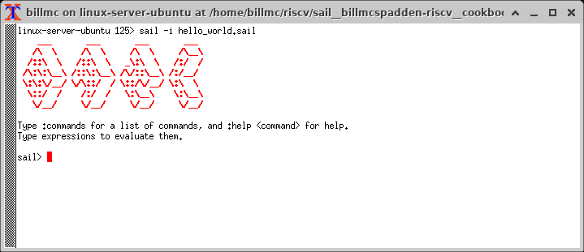
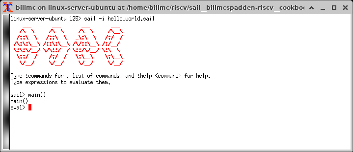
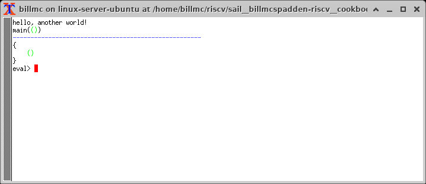
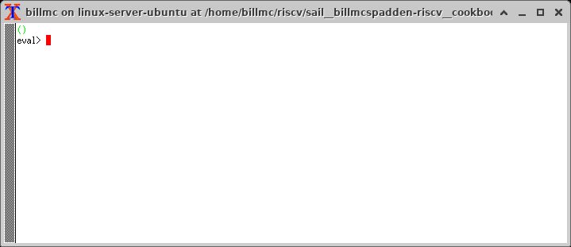
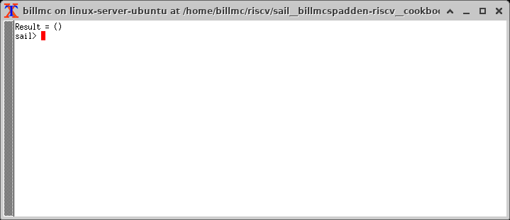
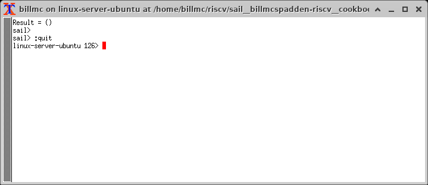

:doctype: book
:sectids:
The Sail Programming Language: A Sail Cookbook
==============================================
William C. McSpadden <bill@riscv.org>; Martin Berger <contact@martinfriedrichberger.net>
:toc:
:toc-placement: preamble
:toclevels: 2

:showtitle:


// Need some preamble to get TOC
{empty}


[#list_of_programming_examples]
== List of programming examples (in increasing complexity)

The main purpose of this document,  is to give the user a quick 
reference to Sail coding examples. The following is a list of 
all the programming examples found in this document.

<<hello_world>>

<<my_replicate_bits>>

<<list_iteration_example>>

<<scattered-definitions>>

<<Sail-Calls-C-function>>

<<Sail-Calls-C-function-for-YAML>>

<<simple_cpu_example>>


:sectnums:
== Introduction

Sail is a programming language that was developed for the purpose
of clearly, concisely and completely describing a computer's 
Instruction Set Architecture (ISA).  This includes...

- specifying the opcodes/instructions and their behaviours
- specifying the general purpose registers
- specifying the control space registers

Sail was the language chosen by RISC-V International 
to formally specify the RISC-V open source ISA.

This document,  while not RISC-V specific,  is especially targeted for engineers who are working on specifying the RISC-V ISA. 

This cookbook is intended to supply the beginning Sail programmer with
some simple, well-commented, bite-size program fragments that can
be compiled and run.

**github** is used to host the development of Sail.  You can find the 
repository at the following URL:

https://github.com/rems-project/sail

Currently,  the work on this cookbook can be found on a branch in the
above repo.  This branch is:

https://github.com/billmcspadden-riscv/sail/tree/cookbook_br

So this is the place you should probably clone.  (Eventually,  this
branch will be merged to the release branch.)

Other documentation:

There is another useful Sail document that you should know about.  It is
"The Sail instruction-set semantics specification language" by Armstrong, et. al.  It can be found at:

https://github.com/billmcspadden-riscv/sail/blob/cookbook_br/manual.pdf

While useful,  the document does not contain a useful set of programming
examples.  That is the purpose of *this* document.


== How to contribute (Bill)

We are hopeful that as you learn the Sail programming language,  that you too would want to create some code snippets that you think someone might find helpful.

The simple "hello world" program (found in cookbook/functional_code_snippets/hello_world/) provides a template for writing a new code snippet. For an example 
that lives in a single Sail file, this should be sufficient.  Create a test directory (with a useful name), copy the Makefile and the .sail file into that directory,  and then write your code.  And finally,
edit this .adoc file and give a description of what
the example file is intended to do.

Once you have completed your snippet and verifies that it works,  you should make an entry in this document.  Pleas see <<hello_world>> to see how you should include your snippet in this document.  You should at least include the .sail file and give a brief descritpion.  Also, please make an entry in 
<<list_of_programming_examples>> for quick perusal by readers.


=== Coding and indentation style

We do not have a preferred coding style for these little code snippets.  With regards to indentation style,  the RISC-V modle follows a vaguely K&R style. Some of the program snippets (those originating with Bill McSpadden) follow the Whitesmiths indentation style.  All styles are welcome.

For a list and description of popular indentation styles, steer your browser to...
https://en.wikipedia.org/wiki/Indentation_style.

=== Brevity

Program examples should be short, both in terms of number-of-lines and in terms of execution time.  Each example should focus on one simple item.  And the execution of the example item should be clear.  The example should be short, standalone and easy to maintain.

Now,  we do have one example in this Cookbook that somewhat violates this request.  The programming example, <<simple_cpu_exampl>>,  is more complex.  But it is meant to demonstrate the usefulness of Sail in defining the functionality of an ISA.

=== Maintainership (when something breaks)

We would also ask that if you contribute a code example,  that you would maintain it.

=== Syntax highlighting for Sail

Syntax highlighting for several editors (emacs, vim, Visual Studio, etc)
can be found at:

https://github.com/rems-project/sail/tree/sail2/editors

It is beyond the scope of this document to describe how to use
the syntax highlighting for the various editors.

== Sail installation

Sail is supported on a number of different platforms.  MacOs and Lunix/Ubuntu seem to be the most used platforms.  


TBD

=== Ubuntu (Bill Mc.)

TBD

=== MacOS (Martin)

TBD

=== Docker

Docker is used as a ....

=== Windows 
Support of a native command line interface is not planned.  If you
want to run Sail under Windows,  plan on running it under Cygwin or
Windows Subsystem under Linux.

=== Windows: Cygwin and/or WSL (Bill Mc.,  low priority)

If there is a demand,  a port to Cygwin will be attempted.

=== Other?

Are there other OS platforms that should be supported?
Other Linux distis?  Or will Docker support?

== Basic description
=== What Sail is
Sail is a programming language that is targetted for
 specifying an ISA.  Once specified, a set of
instructions (usually found in a .elf file) can then
be executed on the "model" and the results observed.

The model is a sequential model only;  at this time, 
there are no semantics allowing for any type of parallel
execution.  

=== What sail is not 
Sail is not an RTL (Register Transfer Language).
There is no direct support for timing (as in clock
timing) and there is no support for parallel execution,
all things that an RTL contains.

=== version management and what to expect
TBD

[#hello_world]
== “Hello, World” example program (Bill)
All example programs associated with this cookbook, 
can be found in 
<sail_git_root>/cookbook/functional_code_snippets/

The purpose of this simple program is to show some 
of the basics of Sail and to ensure that you have 
the Sail compiler (and the other required tools)
 installed in your environment.

It is assumed that you have built the sail compiler 
in the local area. The Makefiles in the coding 
examples depend on this.

The following code snippet comes from: 

https://github.com/billmcspadden-riscv/sail/tree/cookbook_br/cookbook/functional_code_snippets/hello_world

hello_world.sail:

// include doesn't appear to render in github
// Therefore, asciidoctor-reducer will be used to create
// a complete (all files included) file, which will be
// committed by git.  

[source, sail]
----
include::../functional_code_snippets/hello_world/hello_world.sail[]
----

So... that's the code we want to compile.  But how do 
we compile it? Remember, we want to use the sail
compiler that was built in this sandbox.  We use a
'make' methodology for building.  The first Makefile
(in the same directory as the example code example) 
is very simple.  It includes a generic Makefile 
(../Makefile.generic) that is used for building 
most of the program examples.


[Note]  If you want to create and contribute your 
own example program and you need to deviate from 
our make methodolgy,  you would do that in your 
own test directory by writing your own Makefile.

The basic flow for building is:  

. Write *.sail  
. sail -c *.sail -o out.c 
. gcc <flags> *.c --> executable


Makefile:

[source, makefile]
----
include::../functional_code_snippets/hello_world/Makefile[]
----

Makefile.generic is the Makefile that does the work for compilation.
It depends on a local compilation of sail. See the [Installation](#sail-installation)
section to understand how to install in the tools for your platform.

Makefile.generic:

[source, makefile]
----
include::../functional_code_snippets/Makefile.generic[]
----

What does the compilation process look like?  Under Ubuntu Linux,  this
is the output you can expect for compiling and running the "hello world"
example program.

```
ubuntu-VirtualBox 227> make
SAIL_DIR=../../.. ; export SAIL_DIR ; \
../../../sail -c -o out hello_world.sail
gcc out.c ../../../lib/*.c  -lgmp -lz -I ../../../lib/ -o out
./out
hello, world!
hello, another world!
ubuntu-VirtualBox 228> 

```

Now that we've examined the Makefiles,  we will make little mention of them
in the rest of this document (except for the example where we discuss the 
C foreign function interface where we will show how Sail can call C functions).

=== "Hello, World" and the Sail interactive interpretter

This section is meant to introduce you to the the Sail interactive interpretter.
We will not go into much detail about running it;  we'll simply take you through the
hello_world example to show you how it is run.

'1. Invocation....



'2. Execute the main() function....



'3. Each "step" in the following images is caused by hitting the "enter" key.
This steps you from one statement to another.  Note the top line: we are being
told we are in the main() function.

image:images/sail_i_hello_world_3.png[]

'4. "enter"

image:images/sail_i_hello_world_4.png[]

'5. "enter".   We now see the body of the main() function.

image:images/sail_i_hello_world_5.png[]

'6. "enter"

image:images/sail_i_hello_world_6.png[]

'7. "enter"

image:images/sail_i_hello_world_7.png[]

'8. "enter". On the top line,  we see the output from the print()
statement, "hello, world".

image:images/sail_i_hello_world_8.png[]

'9. "enter"

image:images/sail_i_hello_world_9.png[]

'10. "enter"

image:images/sail_i_hello_world_10.png[]

'11. "enter".  And now we see the output from the second print statement
pn the top line.



'12. "enter"

image:images/sail_i_hello_world_12.png[]

'13. "enter"



'14. "enter".  We have completed executing the function. The
Result is printed out.



'15. ... and now  ... quit and exit....



== How to print file name and location in print statements: `__FILE__, __LOC__`
[#print__FILE__LOC__] 
A relatively recent addition  to sail was the 

`printf__FILE__LOC__.sail`:

[source, sail]
----
include::../functional_code_snippets/print__FILE__LOC__/print__FILE__LOC__.sail[]
----

The output from running the executable:

```
ubuntu-VirtualBox 259> make
SAIL_DIR=../../.. ; export SAIL_DIR ; \
../../../sail -c -o out print__FILE__LOC__.sail
gcc out.c ../../../lib/*.c  -lgmp -lz -I ../../../lib/ -o out
./out
hello, world!
file: print__FILE__LOC__.sail
loc:  print__FILE__LOC__.sail:20.27-20.34
ubuntu-VirtualBox 260> 
```

== Data types
=== effect annotations
=== Integers
- Int
- int
- Multi-precision

=== type variables
What does " 'n " mean?

=== Bits

=== Strings

=== Lists

=== Structs

=== mappings

=== Type declarations

Sail is a modern programming language, in the ML tradition and has
many forms of type constructors, in particular structs, unions, enums
and bitfields. TBC

=== Type declarations (1): Structs

Note, as of 28 July 2022,  pattern matching on structs is not possible. See https://github.com/rems-project/sail/issues/179

=== Type declarations (2): Unions 
=== Type declarations (3): Enums 
=== Type declarations (4): Bitfields

Bitfields are a staple of ISA specifications, and Sail offers convenient support for bitfields. Here is an example from the RISCV specification:

[source, sail]
----
include::../functional_code_snippets/bitfields/example1.sail[]
----

A bitfield definition creates a wrapper around a bit vector type, and
automatically generates getters and setters for the fields, in case of the example `mtvec`, we have 

- Getter: `mtvec->bits()`
- Setter: `mtvec->bits() = ...`

for the whole bitvector, and for individual fields

- Getters:
    * `mtvec.Base()`
    * `mtvec.Mode()`  
- Setters: 
  * `mtvec.Base() = ...`
  * `mtvec.Mode() = ...`

The bitfield wrapper type will be the something like `union cr = { Mk_cr(bits(xlen)) }`
TODO: this example is too RISCV specific (requires `xlenbits`), use something more generic.


=== Liquid data types (Martin)

"Liquid": Portmanteau of "Logically Qualified"

http://goto.ucsd.edu/\~ucsdpl-blog/liquidtypes/2015/09/19/liquid-types/#:~:text=Liquid%20Types%20are%20a%20constraint,integer%20linear%2C%20set%20theory%20etc. [A Gentle Introduction to Liquid Types By Niki Vazou]

== Execution
=== Functions


[#my_replicate_bits]
=== The ``my_replicate_bits()`` function from the Sail manual (Bill)

First,  let's look at the code that is described in the Sail manual for the function, my_replicate_bits().  

Note:
The following code actually comes from the file 
doc/examples/my_replicate_bits.sail.  It is a little 
bit different than what is shown in the manual 
for reasons that will be covered later.

[source, sail]
----
include::../functional_code_snippets/sail_manual_example_my_replicate_bits/my_replicate_bits.sail[]
----

You will see in this code,  that there is no 'main' 
function,  and as such, will not compile into a C Sail
model.  You will get the following error message:

TODO: get the error message.

In order to get this to compile into a C Sail model,
you will need to provide a main function.  The 
following code shows the implementation of a 
`main()` function that calls my_replicate bits().

[source, sail]
----
include::../functional_code_snippets/sail_manual_example_my_replicate_bits/main.sail[]
----

Because both the files, my_replicate_bits.sail and 
main.sail, need to have the function signatures in 
order to compile (and we want them to be consistent),
the function signatures have been put into a seperate
file that is include by both.  Here is the function
signature file, my_replicate_bits_function_signatures.sail:

[source, sail]
----
include::../functional_code_snippets/sail_manual_example_my_replicate_bits/my_replicate_bits_function_signatures.sail[]
----


== Control flow

[#for_loop_example]
=== for loops (TBD)

[#while_loop_example]
=== while loops (TBD)

[#foreach_example]
=== foreach (TBD)

[#repeat_eaxmple]
=== repeat (TBD)

[#list_iteration_example]
=== List iteration example (Bill)

[source, sail]
----
include::../functional_code_snippets/list_iteration/test.sail[]

----

=== match

== Interaction between C and Sail

**Can we call Sail functions in the C model?**

Short answer: yes!

In more detail, every Sail function will show up with a predictable name in the generated C (with one caveat). For example, if have the following Sail code:

[source, sail]
----
include::../functional_code_snippets/sail_names_in_c/example.sail[]

----

then we get the following C code (abbreviated).

[source, c]
----
include::../functional_code_snippets/sail_names_in_c/example1.c[]
----

for `giraffe1` (and likewise for 'giraffe3'). Note that the  code for `giraffe2` is simply this:

[source, c]
----
include::../functional_code_snippets/sail_names_in_c/example2.c[]

----

So giraffe1 becomes `zgiraffe1`, `giraffe2` becomes `zgiraffe2`` and so on. If we only provide a
Sail declaration but no corresponding Sail implementation (as we do for `giraffe2`, we only get a C declaration. OTOH, 
if we only provide a Sail function but no separate 
Sail header, as we do for `giraffe3`,
we still get a C implementation and a separate prototype.

Note that all the `zgiraffe*` functions are global and can be called from C. This is done for example in the RISCV model, where the Sail functions 

- `tick_platform` https://github.com/riscv/sail-riscv/blob/master/model/riscv_platform.sail#L495
- `tick_clock` https://github.com/riscv/sail-riscv/blob/master/model/riscv_platform.sail#L319

are explicitly called in the handwritten C function

https://github.com/riscv/sail-riscv/blob/master/c_emulator/riscv_sim.c#L935-L936

Note that if you overload a functions `f1`, ..., `fn` to a new funtion `f` and then
call `f` in the Sail code, the generated C will not use `zf` but rather the appropriate `zfi`. For example


[source, sail]
----
include::../functional_code_snippets/sail_names_in_c/example-overloading.sail[]
----

results in the following C snippet:

[source, c]
----
include::../functional_code_snippets/sail_names_in_c/result-overloading.c[]
----

Scattered definitions (typically used in the decode and execute clauses) might be seen as a form of overloading. Here is an example of a definition of `execute``:

[source, sail]
----
include::../functional_code_snippets/sail_names_in_c/example-execute.sail[]
----

Here the generated C will contain a single function `zexecute` that does a big `case`-distinction that dispatches to the relevant parts of the scattered definition:

[source, c]
----
include::../functional_code_snippets/sail_names_in_c/result-execute.c[]
----

**Warning.** The Sail compiler does aggressive  dead code elimination: Sail functions, like `giraffe4` which are not used (called) get eliminated and do **not** appear in the generated C code. 

**Note.** See https://github.com/rems-project/sail/issues/177

Here's another example of using the C foreign language interface...

[#Sail-Calls-C-function]
=== Sail Calls C function

Here is the sail code where we're trying to call a C function and
return a value to Sail.

[source, sail]
----
include::../functional_code_snippets/sail_calls_cfunc/sail_calls_cfunc.sail[]
----

Here is the C code,  in a .c and .h file.  The .h file is needed because
it needs to be included in the out.c file that Sail generates for the 
C simulator.

First,  the cfunc.h file ....

[source, c]
----
include::../functional_code_snippets/sail_calls_cfunc/cfunc.h[]
----

And now,  cfunc.c,  which implements the functions...

[source, c]
----
include::../functional_code_snippets/sail_calls_cfunc/cfunc.c[]
----


Here is the Makefile used to compile all of this.

[source, makefile]
----
include::../functional_code_snippets/sail_calls_cfunc/Makefile[]
----


[#Sail-Calls-C-function-for-YAML]
=== Sail Calls C function to get value from a YAML file

We now extend the example to show how you can get a value from a YAML
file and return it to the calling C function.

This example depends on the library, libfyaml.  You need to have this 
installed on your system in order to build the test.

Here's a simplified YAML file (it's part of the RISCV-Config file):

[source, yaml]
----
include::../functional_code_snippets/sail_calls_cfunc_for_yaml/rv32i_isa.yaml[]
----

In the following Sail file,  we go looking for the setting for /hart0/physical_addr_sz.

[source, sail]
----
include::../functional_code_snippets/sail_calls_cfunc_for_yaml/sail_calls_cfunc_for_yaml.sail[]
----

The real work is done in the cfunc files.  Here is the C file that
opens a YAML file,  searches for the key,  and then returns the value.
(Note that there is also a cfunc.h file but we will not inspect it here.)

[source, c] 
----
include::../functional_code_snippets/sail_calls_cfunc_for_yaml/cfunc.c[]
----

And finally,  here is the Makefile that builds the executable:

[source, makefile]
----
include::../functional_code_snippets/sail_calls_cfunc_for_yaml/Makefile[]
----


== Other stuff

[#scattered-definitions]
=== Scattered definitions:  Why?  What are they?

When specifying an ISA,  you'd like to coalesce the defintions of an
instruction (or a set of instructions,  if they have some similarity to 
each other) into a single file.  One benefit of such organizational principles
is that you can take a single Sail file and import it into a text specification
when describing the instructions whithout having to tear apart a much larger
file.

Functions, unions and mappings are definitions that can be scattered amongst
multiple files.  Following is an example of scattered definitions of functions,
unions and mappings.

Here is the opening of the scattered definitions for this example:

[source, sail]
----
include::../functional_code_snippets/scattered_definitions/scattered_definitions_begin.sail[]
----

Here is the top-level Sail module. Note that it calls 2 instances of
func(), the difference being the "argument" that is passed to it.  But it's
not really an argument;  the "argument" is used to decide which flavor of func()
should be called.

[source, sail]
----
include::../functional_code_snippets/scattered_definitions/scattered_definitions.sail[]
----

The file, scattered_definitions_include.sail, is use to hold function signatures,
which get included in several files.

[source, sail]
----
include::../functional_code_snippets/scattered_definitions/scattered_definitions_include.sail[]
----

Here are the 2 scattered definitions for func(),  found in 2 different files:

[source, sail]
----
include::../functional_code_snippets/scattered_definitions/a.sail[]
----

[source, sail]
----
include::../functional_code_snippets/scattered_definitions/b.sail[]
----

And here is where the scattered definition of func() is end'd.  The end'ing is
broken out into a separate file so that many (all?) scattered definitions can
be closed in the same place.  This should match the opening of scattered definitions
being done in one place.

[source, sail]
----
include::../functional_code_snippets/scattered_definitions/scattered_definitions_end.sail[]
----

And finally, there is an order of compilation of Sail code that must be observed.
The scattered definitions must be compiled last.  As such,  the Makefile
specifies the compilation order as seen here:

[source, makefile]
----
include::../functional_code_snippets/scattered_definitions/Makefile[]
----


===  __FILE__ , __LINE__ , __LOC__

=== Variable argument list support 

What support does Sail have for a variable argument
list for its functions?

TBD

== Description prelude.sail

prelude.sail contains the function signatures and implemenmtations
of many support functions.  

=== description of print, sext, equility etc.  standard template stuff
=== the C interface

[#simple_cpu_example]
== Simple CPU example (Martin)
- From nand2tetris


== Formal tools that analyze Sail source code

coverage

== FAQs (Frequently Asked Questions)

Following are a set of FAQs that were generated via set of questions to the Sail developers.

include::./Sail_FAQ.adoc[]

include::./RISCV_model_FAQ.adoc[]

