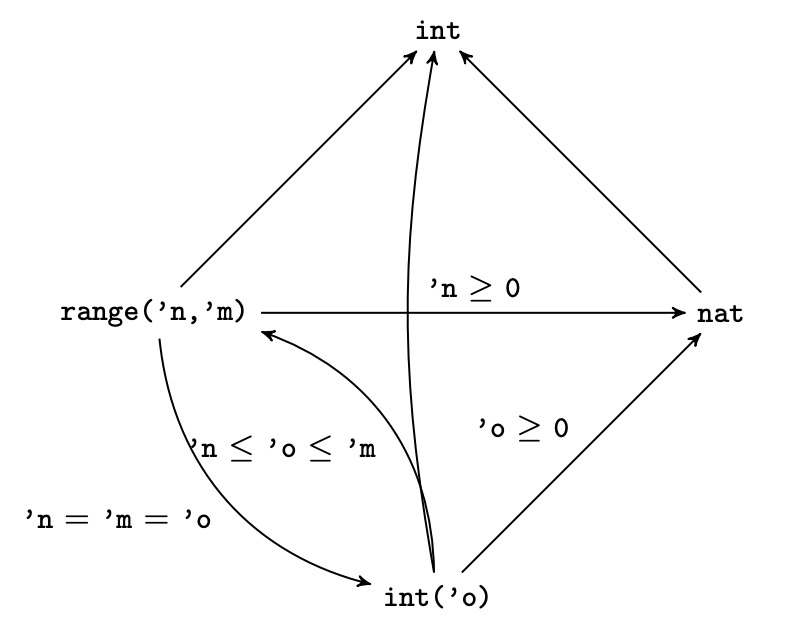
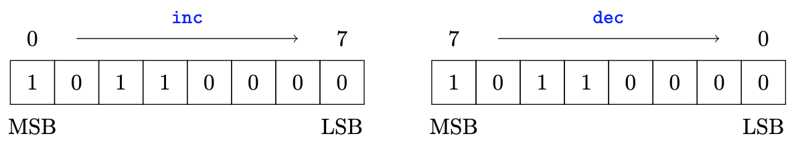

## Introduction

There are 3 core things we want to do with a system like Sail

1. Write an ISA (e.g. RISC-VI)
2. Write flow-specific tooling (e.g. auto-generate an assembler from an ISA spec)  
3. Auto-generate a fast model (C emulator) for the ISA.


The first is wonderful in Sail once one has filled the gap in the documentation. (2) is hard because of the

- complex architecture of the Sail system (meta-programmed)
- Dependence on OCaml (not widely known)

Finally (3) has the additional problem of the auto-generated
C-emulator being really hard to understand since auto-generated code
is not human friendly.
    
Here are some basic criticisms.


- Sail the PL (wrong: is lovely)
- Sail Documentatation (true, is bad, but we can train locally)
- Existing Sail tooling (true, but we can improve)
- Sail system
   - Archtecture (true and basically not changable)
   - C emulator is auto-generated
   - Ocaml dependence(true and basically not changable)
      the combination of those two makes it very difficult to extend the Sail system, in particular the widely used C-emulator
- What are the alternatives
  - RTL (Chisel Verilog). Wrong level of abstraction
  - C++/C/Python, how to use in verification
  - Existing DSL (ASL, Bluespec etc). 
  - Cook new DSL, will take 10 person years


## Sail AST
	
The Sail AST definition is in `src/ast.ml` which is autogenerated from `language/ast.ott` (using the Ott tool and `src/ast.sed`. Here
is the definition of expressions.

```
and 'a exp_aux =  
 | E_block of ('a exp) list 
 | E_id of id 
 | E_lit of lit 
 | E_cast of typ * ('a exp) 
 | E_app of id * ('a exp) list 
 | E_app_infix of ('a exp) * id * ('a exp) 
 | E_tuple of ('a exp) list 
 | E_if of ('a exp) * ('a exp) * ('a exp) 
 | E_loop of loop * ('a internal_loop_measure) * ('a exp) * ('a exp)
 | E_for of id * ('a exp) * ('a exp) * ('a exp) * order * ('a exp) 
 | E_vector of ('a exp) list 
 | E_vector_access of ('a exp) * ('a exp) 
 | E_vector_subrange of ('a exp) * ('a exp) * ('a exp) 
 | E_vector_update of ('a exp) * ('a exp) * ('a exp) 
 | E_vector_update_subrange of ('a exp) * ('a exp) * ('a exp) * ('a exp) 
 | E_vector_append of ('a exp) * ('a exp) 
 | E_list of ('a exp) list 
 | E_cons of ('a exp) * ('a exp) 
 | E_record of ('a fexp) list 
 | E_record_update of ('a exp) * ('a fexp) list 
 | E_field of ('a exp) * id 
 | E_case of ('a exp) * ('a pexp) list 
 | E_let of ('a letbind) * ('a exp) 
 | E_assign of ('a lexp) * ('a exp) 
 | E_sizeof of nexp 
 | E_return of ('a exp) 
 | E_exit of ('a exp) 
 | E_ref of id
 | E_throw of ('a exp)
 | E_try of ('a exp) * ('a pexp) list
 | E_assert of ('a exp) * ('a exp) 
 | E_var of ('a lexp) * ('a exp) * ('a exp) 
 | E_internal_plet of ('a pat) * ('a exp) * ('a exp) 
 | E_internal_return of ('a exp) 
 | E_internal_value of value
 | E_constraint of n_constraint

and 'a exp = 
 | E_aux of ('a exp_aux) * 'a annot
```

Note that `exp_aux' is not itself the AST for Sail expressions, but
`exp` which wraps `exp_aux' with an 'annotation' type `annot`. The
purpose of the latter is to give an indication how the corresponding
AST node was generated and where it can be found in the source
files. Annot has the following options (and can be found in
`src/parse_ast.ml`):

```
type l =
  | Unknown
  | Unique of int * l
  | Generated of l
  | Range of Lexing.position * Lexing.position
  | Documented of string * l

type 'a annot = l * 'a
```

## Structure of Sail processing.

The entry point into running sail is `src/sail.ml`. Sail execution
proceeds as follows.

1. Lexing and parsing.
2. Run preprocessor (for directives like `$include
   <prelude.sail>`. Note that, unlike C, the Sail preprocessor works
   (recursivly) on Sail ASTs rather than strings. Note that such
   directives that are used are preserved in the AST, so they also
   function as a useful way to pass auxiliary information to the
   various Sail backends.
3. AST desugaring.
4. the type-checker is run which produces a fully type-checked
   AST. Type annotations are attached to every node (for which an
   annotation makes sense).
5. After type-checking the Sail scattered definitions are de-scattered into single functions.
6. Target-specific rewrites. Sail has numerous targets (C, OCaml, Coq, HOL4, Isabelle/HOL, SMT-LIB) which might
   need different treatment. The file `src/rewrites.ml' defines a list of rewrites:

   ```
   let all_rewrites = [
    ("no_effect_check", Basic_rewriter (fun _ defs -> opt_no_effects := true; defs));
    ("recheck_defs", Checking_rewriter recheck_defs);
    ("recheck_defs_without_effects", Checking_rewriter recheck_defs_without_effects);
    ("optimize_recheck_defs", Basic_rewriter (fun _ -> Optimize.recheck));
    ("realise_mappings", Basic_rewriter rewrite_ast_realise_mappings);
    ("remove_duplicate_valspecs", Basic_rewriter remove_duplicate_valspecs);
    ("toplevel_string_append", Basic_rewriter rewrite_ast_toplevel_string_append);
    ("pat_string_append", Basic_rewriter rewrite_ast_pat_string_append);
	...
	```
	We also have a lot of target specific rewrites (also in `src/rewrites.ml') for example: 
	
	```
    let rewrites_lem = ...
    let rewrites_coq = ...
    let rewrites_ocaml = ...
    let rewrites_c = ...
    let rewrites_interpreter = ...
    ```
7. After  rewrites the backend is created.

## Type-checking
The Sail type-checker is contained within `src/type_check.ml`. 
## Rewriting
The rewriting is defined in `src/rewriter.ml`.  Most of the re-writes
are defined in `src/rewrites.ml`, although the re-writer is used for
other rewrite like passes such as e.g. constant folding in
`src/constant_fold.ml` which combines the rewriter with the Sail
interpreter.
## Monomorphisation 
Code is in `src/monomorphise.ml`
## Jib
The C and SMT backends for Sail use a custom intermediate
representation (IR) called Jib. It's a form of desugared Sail, a kind
of simple WHILE language. Like the full AST this is defined as an ott
grammar in `language/jib.ott`. The corresponing OCaml code is autogenerated. Here is the core of Jib's definition.
	
```
type  instr_aux = 
   I_decl of ctyp * name
 | I_init of ctyp * name * cval
 | I_jump of cval * string
 | I_goto of string
 | I_label of string
 | I_funcall of clexp * bool * (id * ctyp list) * (cval) list
 | I_copy of clexp * cval
 | I_clear of ctyp * name
 | I_undefined of ctyp
 | I_match_failure
 | I_end of name
 | I_if of cval * (instr) list * (instr) list * ctyp
 | I_block of (instr) list
 | I_try_block of (instr) list
 | I_throw of cval
 | I_comment of string
 | I_raw of string
 | I_return of cval
 | I_reset of ctyp * name
 | I_reinit of ctyp * name * cval

and instr = 
   I_aux of instr_aux * iannot

type  cdef = 
   CDEF_reg_dec of id * ctyp * (instr) list
 | CDEF_type of ctype_def
 | CDEF_let of int * ((id * ctyp)) list * (instr) list
 | CDEF_spec of id * string option * (ctyp) list * ctyp
 | CDEF_fundef of id * id option * (id) list * (instr) list
 | CDEF_startup of id * (instr) list
 | CDEF_finish of id * (instr) list

``` 
The Sail command line option `-ir` target allows Sail to be
converted into this IR without any further processing.
Jib related files are contained within a sub-directory `src/jib/`. Tranlation from Sail to Jib proceeds in two steps:

- Convert Sail to A-normal form (ANF) in `src/jib/anf.ml` 
- Convert ANF to Jib by  `src/jib/jib_compile.ml`.

The Jib representation has the advantage of being much simpler than
the full Sail AST, and it removes a lot of the typing complexity, as
types are replaced with simpler ones (`ctyp`). Note that many
Jib-related types are prefixed by c as it was originally only used
when generating C.

The key optimisation in generating Jib is to analyse Sail types using
SMT to try to fit *arbitrary-precision* types into smaller
*fixed-precision* machine-word types that exist within Jib. To aid in
this we have a specialisation pass that removes polymorphism by
creating specialised copies of functions based on how their
type-quantifiers are instantiated. This can be used in addition to the
Sail monomorphisation above.

## Jib to SMT 
TBD

## Pragmas

Sail has a few pragmas, handled in `src/process_file.ml`. Currently we
have the following pragmas:

- `define`
- `include`
- `ifdef`
- `ifndef`
- `else`
- `endif`
- `option`
- `optimize`
- `latex`
- `property` More generally, what's SMT, Z3 and how to use it (recursion, pitfalls)
- `counterexample` The only difference beteween `$property` and `$counterexample` seems to be that the latter adds
    - `(set-option :produce-models true)` as first line
    - `(get-model)` as last line
  
  of the produced output SMT-LIB file. Rest seems to be identical.
- `suppress_warnings`
- `include_start`
- `include_end`

---


## Types
### Kinds:

We seem to have the following kinds:

- `Int`, as used in e.g. `type xlen : Int = 32`
- `Type`, used like so, e.g. 
          
      val not_implemented : forall ('a : Type). string -> 'a effect {escape}`
- `Order`
- `Bool`, I imagine used like so `type booler : Bool = false`

From `sail-github-repo/src/type_check.ml` we see this kinding information

          ("range", [K_int; K_int]);
          ("atom", [K_int]);
          ("implicit", [K_int]);
          ("vector", [K_int; K_order; K_type]);
          ("bitvector", [K_int; K_order]);
          ("register", [K_type]);
  	      ("bit", []);
          ("unit", []);
  	      ("int", []);
          ("nat", []);
          ("bool", []);
          ("real", []);
  	      ("list", [K_type]);
          ("string", []);
          ("itself", [K_int]);
          ("atom_bool", [K_bool])

What I am unsure about is the difference between `int(.)` and `atom(.)`, given that both are of kind `Int`.

### Type-variables

You can name type-variables using an as pattern like:

    let x as bits('width) = ... in ...
   
   
### Basic numeric types:
- Arbitrary precision integers: int
- Arbitrary precision naturals: nat
- Integer ranges `range(′n,′ m)` where  he type `range(’n,’m)` is
an inclusive range between the `Int`-kinded type-variables `’n` and `’m`
- The type `int(’o)` is an integer
exactly equal to the `Int`-kinded type-variable `’n`, i.e. `int(’o)` = `range(’o,’o)`.

All these types can be used interchangeably provided the rules summarised in the below diagram are satisfied (via constraint solving).  

### Other types
- Arbitrary precision reals: `real` (but no floating-point arithmetic).  The type `real` is used to model arbitrary real numbers,
so floating point instructions could be specified by mapping the floating point inputs to real numbers,
performing the arithmetic operation on the real numbers, and then mapping back to a floating point
value of the appropriate precision
- Strings
- Reals
- `bit` type with members `bitzero` and `bitone`. Note: `bit` is **not** a numeric type, i.e. not `range(0, 1)`

### ADTs
### Enums
### Structs
### Tuples
### Unions
### Bitfields
A bitfield definition creates a wrapper around a bit vector type, and generates getters and setters for
the fields. 
Explain in more detail how bitfields autogenerate functions. For example, 

    bitfield Uinterrupts : xlenbits = {
      UEI : 8,  /* external interrupt */
      UTI : 4,  /* timer interrupt    */
      USI : 0   /* software interrupt */
    }
	
autogenerates the following functions:	

- `bits()`
- `UEI()`
- `get_UEI`
- `set_UEI`
- `update_UEI` (This one is pure, i.e. returns a modified copy, but leaves the original unchanged)
- ...

See section 4.10.4

Here are some examples. Assume we define

     bitfield Mstatush : bits(32) = {
       MBE  : 5,
       SBE  : 4
     }
     register mstatush : Mstatush

then we can do

	 mstatush->bits() = 0b00000000000010101000000011100010;
	 
to set the register `mstatush` in one go. For reading we do eg.

	 mstatush.MBE() 
	 
while writing is like this	 
	 
	 mstatush->MBE() = 0b0; 


/* Provides the uip read view of sip (s) as delegated by sideleg (d). */
function lower_sip(s : Sinterrupts, d : Sinterrupts) -> Uinterrupts = {
  let u : Uinterrupts = Mk_Uinterrupts(EXTZ(0b0));
  let u = update_UEI(u, s.UEI() & d.UEI());
  let u = update_UTI(u, s.UTI() & d.UTI());
  let u = update_USI(u, s.USI() & d.USI());
### Registers
### Vectors

Let's start with an example:

    let v : vector(3, dec, int) = [1, 2, 3]

What do the three arguments mean?

- The first argument of the vector type is a numeric expression representing the length of the vector, 

- `dec` is the order. Sail allows two different
types of vector orderings; increasing (inc) and decreasing (dec). Here is an example: 

- The last argument is the type of the vector’s elements. 

Sail allows bitvector literals to be specified in:

- Hexadecimal, e.g. `0x12FE`
- Binary, e.g. `0b1010100`

*Note* that the length of a hex literal is always four times the number of digits, and
the length of binary string is **always** the **exact** number of digits, so `0x12FE` has length 16, while `0b1010100`
has length 7.

**Accessing vectors.** A vector can be indexed by using the vector[index] notation.
So, in the following code:
let v : vector(4, dec, int) = [1, 2, 3, 4]
let a = v[0]
let b = v[3]
a will be 4, and b will be 1 (note that v is dec). By default, Sail will statically check for out of bounds
errors, and will raise a type error if it cannot prove that all such vector accesses are valid.

**Slicing  vectors.** As a special case of access, vectors can be sliced using the 

     vector[indexmsb .. indexlsb]
   
 notation. The indexes are always supplied with the index closest to the MSB being given first, so 
- the bottom 32-bits of a
decreasing bitvector v as `v[31 .. 0]`, 
- the upper 32-bits of an increasing bitvector as `v[0 .. 31]`,

i.e. the indexing order for decreasing vectors decreases, and the indexing order for increasing vectors
increases.

**Updating vectors.**   A vector index can be updated using `[vector with index = expression]` notation. For example

    [v with 0 = bitzero]

We can also update subranges    using `[vector with indexmsb .. indexlsb = expression]`, where the
order of the indexes is the same as described above for increasing and decreasing vectors. Here is an example:

    [v with 37 .. 36 = 0b00]

Note that these expressions are  just syntactic sugar for the built-in functions `vector_access`, `vector_subrange`, `vector_update`, and `vector_update_subrange`. 

**Iterating over a vector in a type-safe way.** Here is an example:

    val f : forall 'n, 'n > 0. vector('n, dec, bits(5)) -> bool
    function f ( regs ) = {
       foreach ( x from 0 to (length(regs) - 1) ) {
          if ( regs[x][0] == bitone) then return true
      };
    	false
    }

### Lists
Sail also has `list` as a built-in type. For example:

    let l : list(int) = [|1, 2, 3|]

where the  list concatentation  operator is `::` and the empty list is `[||]`. Pattern matching is the sole (?) destructor for lists.
Note that `list` is a generic type constructor, so you can do e.g.:

    val f : int -> list((int, list(int)))
    
    function f (n) = {
             [|(17,[|4|] )|]
    }
	
Note that Sail currently does not have a concatenation operator. We can write a monomorphic one, e.g.

    val concat_list : forall 'n, ('n > 0 ). ( list( bits('n) ), list( bits('n) ) ) -> list( bits('n) )
    function concat_list ( l1, l2 ) = {
       match l1 {
          x :: xs => (x :: ( concat_list( xs, l2 ) ) ),
          [||] => l2
       }
    }

but this is not currently accepted by the `-c` option. It is accepted by the `-just_types` option.
	
### Implicits
Semantics of `implicit` keyword. So implicits, implicit parameters in
Scala and type classes in Haskell / Rust. The implicit keyword is very
restricted:

- Only usable for integer arguments,
- They have to be in the leftmost position.
  
Implicits are essentially used so if you have a return type, and they
type-checker knows the length of the return type (like in `bits('m)`)
you can have that available as a variable in the function body for
flow-typing etc. The type-checker will desugar it into a explicit
argument of type `int('m)` and add an explicit argument at each call
site. If the type system cannot figure out the implicit argument at
the call site simply it will just ask for it to be given explicitly.
In other words, if you have a function
   ```
   val f: (implicit(’n), bits(’n)) -> bits(’m)
   ```
   then you can write e.g.
      `g ( f ( arg ) )`
    instead of
      `g ( f ( 64, arg ) )`
    assuming the type-inferencer know that g has a type like
      `val g : bits(64) -> ...`

For an example of implicits see the RISC-V file
<code>prelude.sail</code> where we find:

```
val EXTS : forall 'n 'm, 'm >= 'n. (implicit('m), bits('n)) -> bits('m)
val EXTZ : forall 'n 'm, 'm >= 'n. (implicit('m), bits('n)) -> bits('m)

function EXTS(m, v) = sail_sign_extend(v, m)
function EXTZ(m, v) = sail_zero_extend(v, m)
```

Note also that this currently compiles:

```
default Order dec
$include <prelude.sail>

val f_gt : forall ('n 'm : Int), 'm > 'n. (implicit('m), unit) -> bits('n)
val f_lt : forall ('n 'm : Int), 'm < 'n. (implicit('m), unit) -> bits('n)
val lt : forall ('n 'm : Int), 'm < 'n. implicit('m) -> bits('n)
val gt : forall ('n 'm : Int), 'm > 'n. implicit('m) -> bits('n)

val h : forall ('n 'm : Int), 'm > 'n. (implicit('m), bits('n)) -> bits('n)
function h (size, bv ) = { bv }
```

Note that this is fine, because all we are doing is to declare
functions which can never be called in a type-safe way. This is a bit
like in e.g. System F types like

    forall X. X -> Unit
	
have 0 inhabitants. Still we can declare that type. Note also that the
pathologies above have nothing to do with the `implicit` keyword, e.g.

    val h_explicit : forall ('n 'm : Int), 'm > 'n. (bits('m), bits('n)) -> bits('n)
    function h_explicit (tmp, bv ) = { bv }

exhibits the same problem but id free from  `implicit`.


In order to get implicit resolution to work, we can also use

    ( bla : bits('n) )

instead of just

    bla

### Existential types 
The syntax for existentials is `{variables, constraint. type}`. ... In Sail, existentials, they really are just liquid types in disguise:
  ```
      {'n, C('n). int('n)}
  ```  
   would be equivalent to the more traditional liquid type syntax
   ```
      {'n : int | C('n)}
  ```

   The syntactic restriction we have is essentially that we can always
   translate our existentials into that liquid form, as our syntax
   would allow something like `{'n 'm, C('n, 'm). T('n)}` where the `'m`
   type-variable does not occur in the type. Additionally we don't
   allow the variables in these existentials to be anything other than
   booleans and integers. When used within a datatype declaration D,
   our syntax is logically
   ```
   (exists n. T(n)) -> D (but we omit the -> D because we don't have GADTs)
   ``` 
   as opposed to
   ```
   forall n. (T(n) -> D)
   ```
### Liquid types
## Effects


-  `rreg`: read register
-  `wreg`: write register
-  `rmem`: read memory
-  `rmemt`: read memory and tag
-  `wmem`: write memory
-  `wmea`: signal effective address for writing memory
-  `exmem`: determine if a store-exclusive (ARM) is going to succeed
-  `wmv`: write memory, sending only value
-  `wmvt`: write memory, sending only value and tag
-  `barr`: memory barrier
-  `depend`: dynamic footprint
-  `undef`: undefined-instruction exception
-  `unspec`: unspecified values
-  `nondet`: nondeterminism, from nondet
-  `escape`: potential exception
-  `config`: configuration option
-  `pure`: configuration option
-  `{ ef1, ..., efk }`, finite set of effects, empty being short for <code> pure</code>

Precision of effects: in the past the effect annotations had to be
exact. This is no longer the case (the annotated effects now only have
to be a superset of the actual effects), so it may now be possible to
just have `-O` no longer imply `-no_effects`.

## Exceptions 

Perhaps surprisingly for a specification language, Sail has exception support. This is because exceptions
as a language feature do sometimes appear in vendor ISA pseudocode, and such code would be very
difficult to translate into Sail if Sail did not itself support exceptions. We already translate Sail to
monadic theorem prover code, so working with a monad that supports exceptions there is fairly natural.

The type `exception`  can be any user defined type defined like in the following example:

    scattered union exception
    union clause exception = Epair : (range(0, 255), range(0, 255))
    union clause exception = Eunknown : string
    ...
    end exception

## Bidirectional mappings.

In ISA specifications, we often want to 'equate' types, for example 

    mapping encdec_bop : bop <-> bits(3) = {
      RISCV_BEQ  <-> 0b000,
      RISCV_BNE  <-> 0b001,
      RISCV_BLT  <-> 0b100,
      RISCV_BGE  <-> 0b101,
      RISCV_BLTU <-> 0b110,
      RISCV_BGEU <-> 0b111
    }
    
where we have an enumeration `bop` containing the symbolic names `RISCV_BEQ` etc. We can write  conversion functions like

    encdec_bop_forwards : bop -> bits(3)
    encdec_bop_backwards : bits(3) -> bop
    encdec_bop_forwards_matches : bop -> bool
    encdec_bop_backwards_matches : bits(3) -> bool

as separate functions. However, those functions can be autogenerated using bidirectional mappings. They are defined similarly to functions, with a val-spec and a definition. Currently, they only work
for monomorphic types. Their general syntax is:

    val name : type1 <-> type2
    mapping name = { pattern <-> pattern , pattern <-> pattern , . . . }

which can be shortened to

    mapping name : type1 <-> type2 = { pattern <-> pattern , pattern <-> pattern , . . . }

We can now simply write e.g.  `encdec_bop` for `encdec_bop_forwards` or `encdec_bop_backwards`, and the type-checker will disambiguate. (Note that this requires the LHS and RHS of `<->` to be different.)

## Pattern matching
## Non-determinism / undefined / IMPDEF

Sometimes we want to express underspecification and non-determinism.
Sail has a keyword, "undefined". I have not thought about this deeply,
maybe "undefined" makes it difficult to have constrained
nondeterminism? (E.g. this 64 bit register contains an undefined
number x, subjecet to the contraint that x is prime.)
## Immutable variables

Local immutable bindings can be introduced via the let keyword, which has the following form

    let pattern = expression in expression

Variables bound within function arguments, match statement, and let-bindings are always immutable.


## Mutable variables

Sail also have mutable variables which bound implicitly by using the assignment operator within a block. For example:

    {
        x : int = 3 // Create a new mutable variable x initialised to 3
        x = 2 // Rebind it to the value 2
    }

Note that it is also possible to declare a variables like so:

    {
      x = 2  
    }

In this case `x` will have type `int(2)` so cannot be reassigned to *another* integer value. Note that we can declare ranges, like so

    {
        x : {|2, 3|} = 3;
        x = 2
    }

Note that the syntax `{|2, 3|}` is equivalent to the refinement type

    {’n | ’n in {2, 3}. int(’n)}.

Note I added `|` which, in Sail is `,` (comma)

## Registers
Registers can be declared as follows on the top level (not inside other declarations):
```
   register name : type
```

Registers are essentially top-level global variables and can be set
with the previously discussed l-expression forms. There is currently
no restriction on the type of a register in Sail.

Registers differ from ordinary mutable variables as we can pass around
references to them by name.  A reference to a register `R` is created as
`ref R`. If the register `R` has the type `A`, then the type of `ref R` will
be `register(A)`. There is a dereferencing l-value operator `*` for
assigning to a register reference. One use for register references is
to create a list of general purpose registers, so they can be indexed
using numeric variables. For example:

```
default Order dec
$include <prelude.sail>

register X0 : bits(8)
register X1 : bits(8)
register X2 : bits(8)

let X : vector(3, dec, register(bits(8))) = [ref X2, ref X1, ref X0]

function main() : unit -> unit = {
   X0 = 0xFF;
   assert(X0 == 0xFF);
   (*X[0]) = 0x11;
   assert(X0 == 0x11);
   (*ref X0) = 0x00;
   assert(X0 == 0x00)
}
```

We can dereference register references using the `"reg_deref"` builtin, which is set up like so:
```
val "reg_deref" : forall (’a : Type). register(’a) -> ’a effect {rreg}
```
Currently there is no built-in syntactic sugar for dereferencing registers in expressions
## Casting

## Atom types `atom(.)`. 
Note that `atom(.)` is deprecated, and
the `atom(.)` syntax is the same as `int(.)`.

You can name type-variables using an as pattern like:

    let x as bits('width) = ... in ...

The `let 'x = ...` syntax is then shorthand for

    let x as bits('x) = ... in ... (* or int('x) etc *)


## Preludes and default environment
## Pitfalls and things not explained well in the manual
- Semantics of casting
- `atom(.)`. I think this comes in two forms: `atom(17)` and `atom(true)`, in other words of individual (infinite precision) integers and individual booleans. This is used for kinding.
- Semantics of `assert`
- Kinding
- Flow typing. This is completely unexplained.
- Relationships between data types. For example:

   - The `bit` data type. Looking at the Ocaml implementation, it
     seems to be a built-in data type, but I wonder how it relations
     to enumerations or an algebraic data type ``` enum bit2 =
     bitzero2 | bitone2 ```and also to a bitvector of size one,
     i.e. what is the relationship bit vs bits(1)?

  - Relatedly, what about equalities between `vector(1, dec, t)` and
   `vector(1, inc, t)`
   
  - Between  `vector(0, dec, t)` and `vector(0, inc, t)`
 
- Overloading. As described in the manual [5 § 4.12]: using the overload keyword works as follows. Given
  ```
      overload name = { name_1, ... ,name_n }
  ```  

   When the overloaded name is seen in a Sail definition, the
   type-checker will try each of the overloads in order from left to
   right (i.e. from name_1 to name_n). until it finds one that causes
   the resulting expression to type-check correctly. Note: Multiple
   overload declarations are permitted for the same identifier, with
   each overload declaration after the first adding its list of
   identifier names to the right of the overload list (so earlier
   overload declarations take precedence over later ones).

- Uninterpreted memory read and memory write functions. I THINK those are `read_mem` and `write_mem`.
- Meaning of polymorphism in the Sail manual.
- Effects
- Pragmas
- Semantics of scattered definitions, in particular how (missing) `end` is handeled.
- Syntax and semantics of using / linking external functions. 

Currently Sail makes heavy use of external libraries, in particular
things like GNU MP for infinite precision arithmetic. The syntax of
externals is sparsely documented. Something like

```
val elf_entry = {
  ocaml: "Elf_loader.elf_entry",
  interpreter: "Elf_loader.elf_entry",
  lem: "elf_entry",
  c: "elf_entry"
} : unit -> int
```
## Tool issues
- ELF generation
- Extracting assembly from ISA definition
- Handling memory model issues
- Random testing tools
- Coverage measurement (-c_coverage or -ocaml_coverage)
- Translation to SMT-LIB, with examples (CBMC, recursion, also ISLA and symbolic execution)
- Lack of libraries, or unclear where interesting library functions are located. Want: indexed reference.`
## Translation to C

It is often asked how the C variable names are generated. Answer

- variable name generation (and mangling for monomorphised functions) is deterministic.

- It isn't guaranteed to be stable. 

- It's inspired by the encoding used by GHC Haskell for creating C-compatible names.
  https://gitlab.haskell.org/ghc/ghc/-/wikis/commentary/compiler/symbol-names
  
- The OCaml code doing this is in `sail/src/util.ml` and looks like
  this (as of Nov 2021):
  ```
  let zchar c =
     let zc c = "z" ^ String.make 1 c in
     if Char.code c <= 41 then zc (Char.chr (Char.code c + 16))
     else if Char.code c <= 47 then zc (Char.chr (Char.code c + 23))
     else if Char.code c <= 57 then String.make 1 c
     else if Char.code c <= 64 then zc (Char.chr (Char.code c + 13))
     else if Char.code c <= 90 then String.make 1 c
     else if Char.code c <= 94 then zc (Char.chr (Char.code c - 13))
     else if Char.code c <= 95 then "_"
     else if Char.code c <= 96 then zc (Char.chr (Char.code c - 13))
     else if Char.code c <= 121 then String.make 1 c
     else if Char.code c <= 122 then "zz"
     else if Char.code c <= 126 then zc (Char.chr (Char.code c - 39))
     else raise (Invalid_argument "zchar")

  let zencode_string str = "z" ^ List.fold_left (fun s1 s2 -> s1 ^ s2) "" (List.map zchar (string_to_list str))

  let zencode_upper_string str = "Z" ^ List.fold_left (fun s1 s2 -> s1 ^ s2) "" (List.map zchar (string_to_list str))
  ```

## How to extend the Sail compiler
## Overall Loop, entry point, `main`
## Known bugs (list issues)
- End/scattered stuff
- Recursive functions >>> SMT-LIB generation
## Missing features
- First class support for assembly
- Sail doesn't have datatypes like sets, maps or lists, it does not
  have the ability to build linked data structures. and it absolutely
  does not have any aliasing.  So, if you had to model a FIFO, say, it
  would be a bit ugly: an array plus pointers plus worries about what
  if the array is not big enough. An example where you might want a
  FIFO: Suppose you had an ISA that splits a conventional instruction
  into two parts.  eg a load is split into: issue a memory read and
  then a second part that reads that value Maybe you need a FIFO to
  store the pending reads?  Fix is easy: just add the missing
  datatypes.
- Capturing deliberate underspecification and non-determinism.  That's
  the place that you're most likely to hit problems if it wants more
  precision about the range of behaviours than Arm wanted.
- Sail is not strong enough to describe the memory ordering. The SAIL
  tools include support for integrating several different versions
  (flowing, herd, etc.) but it is not expressed in ASL or SAIL.
